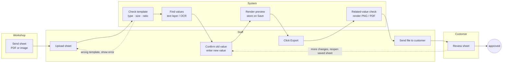
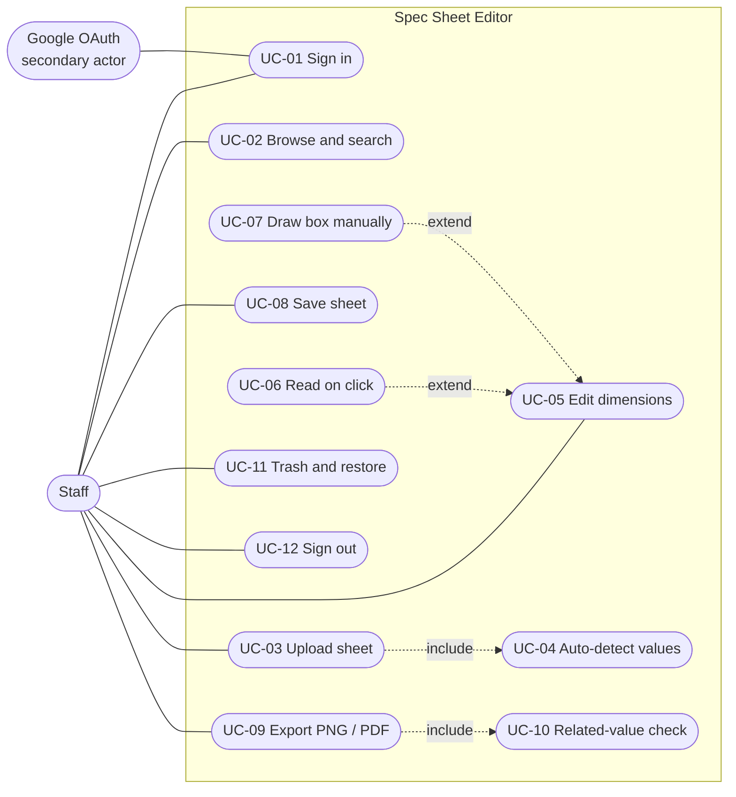
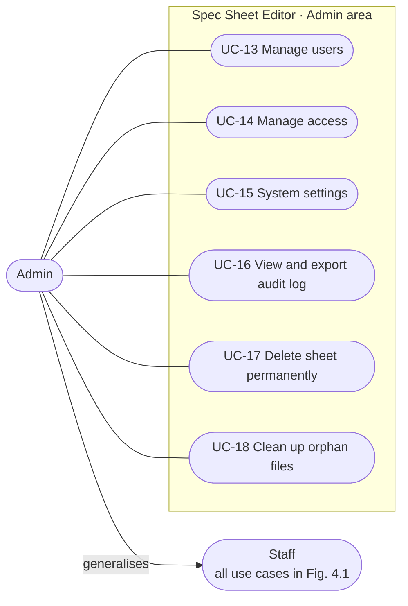
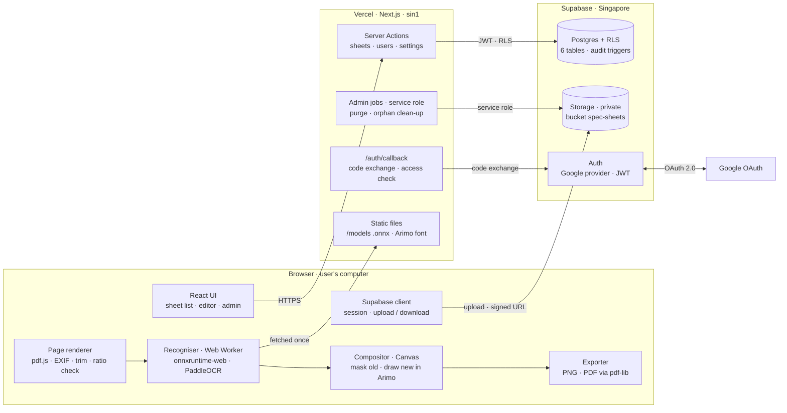
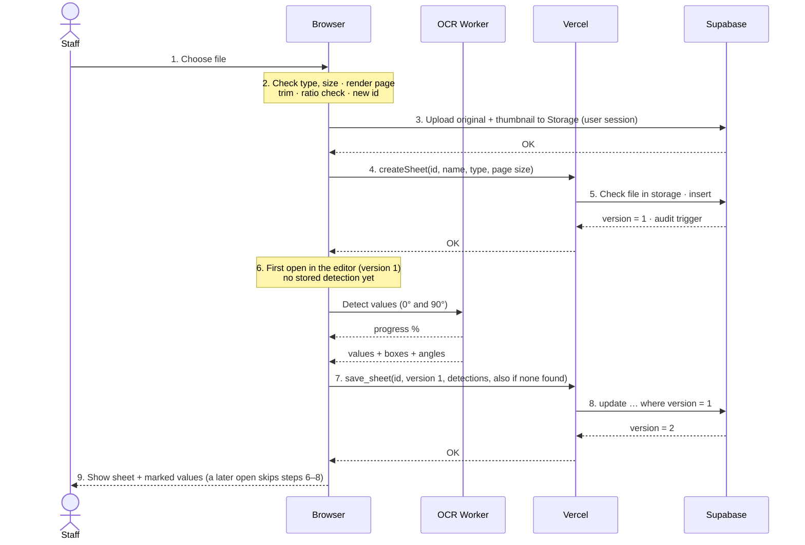
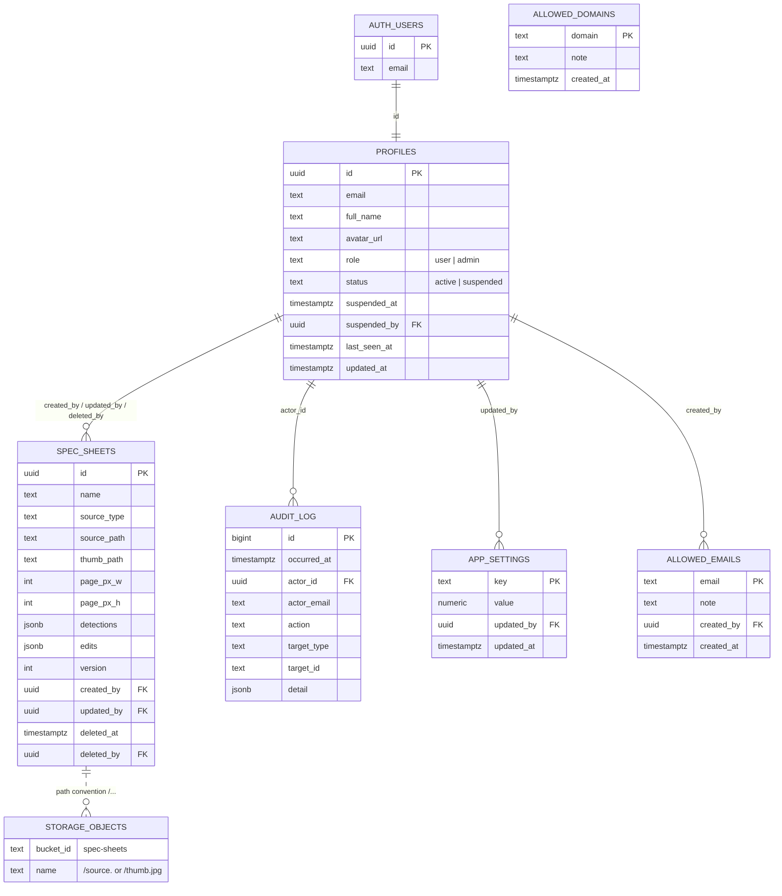

<!-- Markdown edition of spec-sheet-editor-design.html (v1.3). Diagrams are Mermaid redraws of the HTML figures; wireframes stay in the HTML edition. -->

Software Requirements and Design Specification

# Spec Sheet Editor

A system for editing the dimension values on Product Specifications sheets and exporting a copy for customer approval

**Version:** 1.3 (draft for review)

**Date:** 8 October 2026

**Prepared by:** IT Department, CTYHP

**Repository:** SPEC_SHEET_WEBAPP

**Structure:** Following ISO/IEC/IEEE 29148:2018

**Referencing:** Harvard style (author, year)

**Table 0.1.** Revision history

| Version | Date | Changes |
|---|---|---|
| 1.0 | 06/10/2026 | First issue: business process, functions, use cases, architecture, database, technology, UI/UX, test cases. Based on the OCR bake-off in `research/ocr-bakeoff/`. |
| 1.1 | 06/10/2026 | Added the Admin role with full rights (BR-12 to BR-17, F-20 to F-29, UC-13 to UC-18, screens S7–S10, TC-54 to TC-77) and an audit log; evaluated moving image processing to Python (section 7.3); restructured as an academic report with Harvard referencing. |
| 1.2 | 06/10/2026 | Translated into English. Content is unchanged from 1.1. Wireframes and on-screen messages are shown in English; the language of the shipped interface is still an open assumption (Table 1.2). |
| 1.3 | 08/10/2026 | Password sign-in for accounts an Admin creates (one-time password replaced at first sign-in); Google sign-in kept for later, side by side. BR-08, F-01, F-30, UC-01, UC-13, 6.2 and 6.4 updated. |

## Abstract

This document specifies an internal web application that lets staff upload a Product Specifications sheet produced by the workshop (as a PDF or an image), edit the dimension values written on its four CAD drawing panels, save the sheet in the system, and export it as PNG or PDF for customer approval. The specification table, the stone chart and the inspection boxes on the sheet are left untouched. The system reads numbers from the PDF text layer when one exists; otherwise it uses PaddleOCR optical character recognition (OCR) running in the browser. This choice rests on a benchmark of 11 numbers on a sample sheet, in which PaddleOCR located 9 of the 11 numbers correctly while Tesseract read only 5 of 11. Because the machine can misread a value with high confidence, the user always confirms the old value before entering a new one. Version 1.1 adds an Admin role (user management, access control, settings, audit log, permanent deletion) and evaluates moving image processing to a Python server.

**Keywords:** requirements specification, use case, OCR, PaddleOCR, Row Level Security, jewellery specification sheet.

## Contents

1. [Introduction](#chapter-1)
2. [Business description](#chapter-2) — incl. 2.5 Roles and permission matrix
3. [Functional and non-functional requirements](#chapter-3)
4. [Use case model](#chapter-4) — 4.3 Staff and 4.4 Admin use case specifications
5. [System architecture](#chapter-5)
6. [Database design](#chapter-6)
7. [Technology and OCR evaluation](#chapter-7) — 7.3 Is processing images in Python more effective?
8. [User interface and experience design](#chapter-8)
9. [Testing](#chapter-9)
10. [Conclusion and open issues](#chapter-10)
- [References](#references) · [Appendix A — Database SQL](#appendix-a) · [Appendix B — User-facing messages](#appendix-b)

<a id="chapter-1"></a>

## Introduction

### 1.1 Purpose

This document describes the requirements and design of Spec Sheet Editor in enough detail to plan the build, write the code and test it. It is the basis for agreeing the scope before construction starts.

### 1.2 Scope

The system accepts the workshop's Product Specifications sheets as PDF, PNG or JPG, lets users edit the dimension values on the four drawing panels, saves each sheet together with its edits, and exports the result as PNG or PDF. Admins manage users, access, system settings, the audit log and permanent deletion.

Out of scope: redrawing the ring to match new values (a job for the CAD software), editing the specification table or text callouts, accepting phone photos of paper sheets, multi-page PDFs, per-save version history, and sending sheets to customers from inside the system.

### 1.3 Intended readers

Business reviewers should read chapters 2–4 and 8. Developers should read the whole document, especially chapters 5–7 and Appendix A. Testers should read chapters 4 and 9.

### 1.4 Method and conventions

The requirements sections follow ISO/IEC/IEEE 29148:2018 (ISO/IEC/IEEE, 2018). Use case diagrams, the sequence diagram and the «include», «extend» and generalisation relationships use UML 2.5.1 notation (Object Management Group, 2017). Use case specifications list actors, preconditions, postconditions, the main flow and its extensions, in the style of Cockburn (2001). Citations and the reference list follow the Harvard style (author, year) as described by Pears and Shields (2022).

Harvard is a referencing convention, not a standard for software specifications. The content therefore follows ISO/IEC/IEEE 29148, while the presentation follows academic report conventions: title page, abstract, contents, lists of figures and tables, numbered chapters and sections, table captions above tables, figure captions below figures, and an alphabetical reference list.

Identifiers: `BR` business rule, `F` function, `NFR` non-functional requirement, `UC` use case, `S` screen, `TC` test case. "Must" marks a mandatory requirement; "should" marks a recommendation.

**Table 1.1.** Terms and abbreviations

| Term | Meaning in this document |
|---|---|
| **Sheet** | One Product Specifications file from the workshop (PDF or image), together with its saved edits. |
| **Drawing area** | The frame holding the four CAD drawing panels; only this area can be edited. |
| **Dimension value** | A number on the drawing giving a size in millimetres, for example 16.30; it may run horizontally, vertically or diagonally. |
| **Box** | A rectangle, possibly rotated, fitted tightly around one dimension value; used to mask the old value and draw the new one. |
| **Edit** | A record of box, angle, confirmed old value, new value, text colour and background colour. |
| **Result page** | The original page with every edit applied; used for the preview, PNG and PDF. |
| **Trash** | Holds soft-deleted sheets; they can be restored until an Admin deletes them permanently. |
| **OCR** | Optical character recognition. |
| **RLS** | Row Level Security, per-row access control in PostgreSQL (PostgreSQL Global Development Group, n.d.). |
| **Service role** | Supabase's administrative key, which bypasses RLS; it must stay on the server. |

### 1.5 Assumptions and decisions

**Table 1.2.** Assumptions awaiting confirmation and settled decisions

| Type | Statement | Affects |
|---|---|---|
| Assumption | Interface language is still to be confirmed (Vietnamese, English or both). Wireframes in this edition are shown in English. Exported sheets always keep the original English wording. | Chapter 8, Appendix B |
| Assumption | Supabase and Vercel are hosted in Singapore. | Chapters 5, 7 |
| Assumption | Exported PNG and PDF files are not stored in the system. | UC-09 |
| Assumption | The default permitted domain is `ctyhp.vn`. | UC-01, UC-14 |
| Assumption | The first Admin is created once with `npm run admin:create`; from then on Admins create accounts in Admin → Users. | UC-13, Appendix A |
| Decided | Admins hold all four permission groups: users; access and settings; audit log; permanent deletion and clean-up. | Chapters 2–9 |
| Decided | Staff can still move sheets to the Trash and restore them; only Admins delete permanently. | BR-09, UC-11, UC-17 |
| Decided | Recognition uses PaddleOCR; no line removal before reading; users always confirm the old value. | Chapter 7 |

<a id="chapter-2"></a>

## Business description

### 2.1 Context

For each ring design, the workshop issues a Product Specifications sheet with four CAD drawing panels annotated in millimetres, a specification table and a stone chart on the right, and three inspection boxes along the bottom. Customers often ask to change a few dimensions such as band width, inner diameter or setting height. Staff then need to send the customer a sheet that is identical to the workshop's, except for the values that changed, for approval.

All sheets use one template, US Letter landscape, and arrive as PDFs or as images exported from a computer. Images may be low resolution: on the 1135-pixel-wide sample, each digit is only about 8 px tall and touches its dimension line.

### 2.2 Business process



*Figure 2.1. From the workshop sending a sheet to the customer approving it. Shaded steps are performed by the system.*

### 2.3 Sheet zone map

Editable and locked zones are fixed by position on the template. Coordinates were measured on the sample sheet and are expressed as fractions of the page (0–1), so they apply equally to PDFs and images at any resolution.

```text
+--------------------------------------------------------------+ ---
| HEADER (locked)                          | PRODUCT SPECS     |  ^
+------------------------------------------+ table (locked)    |  |
| +--------------------------------------+ |                   |  |
| |  EDITABLE: 4 CAD drawing panels      | | STONE CHART       | 8.5 in
| |  x 0.046 – 0.670   y 0.133 – 0.746   | | (locked)          |  |
| +--------------------------------------+ |                   |  |
| 3 inspection boxes (locked)              |                   |  v
+--------------------------------------------------------------+ ---
|<-------------------------- 11 in --------------------------->|
            ratio 11 / 8.5 = 1.294 (± 2%), US Letter landscape
```

*Figure 2.2. Only dimension values inside the green frame can be edited; the red text callouts inside the frame are not editable either (BR-02).*

### 2.4 Business rules

**Table 2.1.** Business rules

| ID | Rule | Reason |
|---|---|---|
| BR-01 | Only sheets that match the template are accepted: after trimming white borders, the width-to-height ratio is 1.294 within the allowed tolerance (default ±2%); the file is a PDF, PNG or JPG no larger than the maximum size (default 20 MB). Admins can change both limits (UC-15). | Editable and locked zones are defined by position on the template. |
| BR-02 | Only dimension values inside the four drawing panels can be edited. Text callouts, the specification table, the stone chart, the three bottom boxes and the header cannot. | User requirement. |
| BR-03 | The original file is never changed. Edits are an overlay applied when the page is rendered and are stored separately as data. The original is only removed when an Admin permanently deletes the sheet (BR-16). | The original value can always be restored, and a reopened sheet can be edited further. |
| BR-04 | An old value read by the machine must be confirmed or corrected by the user before a new value is entered. | The machine read 2.50 as "2.59" with 90–96% confidence (section 7.3). |
| BR-05 | A new value contains only digits and one decimal separator, matching `^\d{1,3}([.,]\d{1,3})?$`; a comma becomes a point; the new value takes the same number of decimals as the old one ("2.50" + typing 2.6 gives "2.60"). | Keeps the CAD drawing's number format. |
| BR-06 | Exported files are flattened pages; the PDF has no text layer. | Old values cannot leak when the customer selects, copies or searches the file. |
| BR-07 | Before exporting, the system lists the edited values, suggests other places that still show the same old value, and reminds the user that the right-hand table does not change. | Prevents a sheet that says Size 5.75 while the drawing says 16.51. |
| BR-08 | A user may enter the system if and only if their account is not suspended, has replaced any one-time password, and either (a) signed in with Google with an email in a permitted domain or on the permitted email list, or (b) is a password account an Admin created. Domains are matched on the whole part after the `@`, case-insensitively. | Sheets contain order numbers and order specifications. |
| BR-09 | Staff and Admins can both move sheets to the Trash and restore them. | Prevents losing a sheet through a mis-click. |
| BR-10 | When two people edit the same sheet, the one who saves second is told about the conflict; nobody's work is silently overwritten. | Everyone can edit every sheet. |
| BR-11 | Phone photos of paper sheets are not accepted. For multi-page PDFs only page 1 is used. | Photos are skewed and shadowed and do not match the template. |
| BR-12 | There are two roles: Staff and Admin. An Admin has every Staff permission plus the Admin area. | Requirement added on 6 October 2026. |
| BR-13 | At least one active Admin must always remain. Admins cannot suspend their own account. | The system must never be left without an administrator. |
| BR-14 | A suspended account loses access on its very next request, even with a page open. Download links issued earlier expire after the link lifetime (default 10 minutes). | Access is withdrawn immediately when someone leaves. |
| BR-15 | The audit log is append-only: nobody, Admins included, can change or delete entries. | The log must be trustworthy when consulted later. |
| BR-16 | Permanent deletion applies only to sheets already in the Trash, requires the sheet name to be typed to confirm, and cannot be undone. The audit log keeps the sheet name, its creator and who deleted it. | An irreversible action must be protected against mis-clicks. |
| BR-17 | No access change may lock the acting Admin out of the system. | Prevents self-lockout. |

### 2.5 Roles and permission matrix

**Table 2.2.** Permission matrix by role

| Action | Staff | Admin | Use case |
|---|---|---|---|
| View, search and open sheets | ✓ | ✓ | UC-02 |
| Upload, edit values, save | ✓ | ✓ | UC-03 – UC-08 |
| Export PNG / PDF | ✓ | ✓ | UC-09 |
| Move to Trash, restore | ✓ | ✓ | UC-11 |
| Manage users (role, suspension) | — | ✓ | UC-13 |
| Manage permitted domains and emails | — | ✓ | UC-14 |
| Change system settings | — | ✓ | UC-15 |
| View and export the audit log | — | ✓ | UC-16 |
| Permanently delete sheets | — | ✓ | UC-17 |
| Clean up orphan files | — | ✓ | UC-18 |

<a id="chapter-3"></a>

## Functional and non-functional requirements

### 3.1 Functions

Priority: **Must** is required in the first release; **Should** is built if time allows and does not block go-live.

**Table 3.1.** Functions

| ID | Function | Description | Use case | Priority |
|---|---|---|---|---|
| **Authentication** |  |  |  |  |
| F-01 | Sign-in | Sign in with an email and password an Admin issued; a one-time password must be replaced at the first sign-in. Google sign-in (permitted domains and emails) can be switched on later and runs alongside. | UC-01 | Must |
| F-02 | Sign out | End the session in the current browser. | UC-12 | Must |
| **Sheet management** |  |  |  |  |
| F-03 | Sheet list | Thumbnail, name, number of edits, last editor, time; newest first; 50 more rows per load. | UC-02 | Must |
| F-04 | Search by name | Partial, case-insensitive match on the sheet name. | UC-02 | Must |
| F-05 | Upload sheet | Accept PDF, PNG, JPG; check type, size and template; create a thumbnail; store the original. | UC-03 | Must |
| F-06 | Rename sheet | Edit the name in the editor toolbar; the sheet list menu does not rename. | UC-02, UC-08 | Should |
| F-07 | Move to Trash | Soft-delete a sheet. | UC-11 | Must |
| F-08 | Restore sheet | Bring a sheet back from the Trash. | UC-11 | Must |
| **Number detection** |  |  |  |  |
| F-09 | Automatic detection | Use the PDF text layer when present; otherwise run PaddleOCR in the browser; store the result with the sheet. | UC-04 | Must |
| F-10 | Read on click | Read a small area around the click, for values the scan missed. | UC-06 | Must |
| F-11 | Manual box | Draw a box around a value and choose its angle when the machine cannot read it. | UC-07 | Must |
| **Editing and saving** |  |  |  |  |
| F-12 | Edit a dimension value | Confirm the old value, enter the new one, preview it on the sheet. | UC-05 | Must |
| F-13 | Revert to original | Cancel the edit of one value; that area returns to the original exactly. | UC-05 | Must |
| F-14 | Suggest matching values | Offer to apply the same change where the same old value appears elsewhere. | UC-05 | Should |
| F-15 | Save sheet | Save the name and edits; detect version conflicts. | UC-08 | Must |
| F-16 | Unsaved-changes warning | Ask before leaving a page with unsaved changes. | UC-08 | Must |
| **Export** |  |  |  |  |
| F-17 | Related-value check | The dialog shown before export (BR-07). | UC-10 | Must |
| F-18 | Export PNG | The result page at the rendered resolution. | UC-09 | Must |
| F-19 | Export PDF | One page, no text layer, same page size as the original. | UC-09 | Must |
| **Administration (Admin only)** |  |  |  |  |
| F-20 | User list | Every account that has signed in: name, email, role, status, last activity, sheets created. | UC-13 | Must |
| F-21 | Grant / revoke Admin | Switch a user between Staff and Admin; block revoking the last Admin. | UC-13 | Must |
| F-22 | Suspend / reinstate | Suspension takes effect immediately; no self-suspension; the last Admin cannot be suspended. | UC-13 | Must |
| F-23 | Permitted domains | Add and remove; warn how many accounts will lose access; block self-lockout. | UC-14 | Must |
| F-24 | Permitted emails | Let individual emails outside the permitted domains in, for example workshop staff. | UC-14 | Must |
| F-25 | System settings | Maximum file size, low-resolution warning threshold, template ratio tolerance, download link lifetime. | UC-15 | Must |
| F-26 | Automatic audit logging | Every data change and every administrative action is recorded at the database level. | all UCs | Must |
| F-27 | View, filter, export log | Filter by time, person, action and sheet; export CSV. | UC-16 | Must |
| F-28 | Permanent deletion | Delete the record and files of a sheet in the Trash, with typed confirmation. | UC-17 | Must |
| F-29 | Orphan file clean-up | Delete storage folders with no matching record that are older than 24 hours. | UC-18 | Should |
| F-30 | Password accounts | Create an account (name, email, role) with a one-time password shown once; issue a new one-time password, which signs the person out everywhere. | UC-13 | Must |

### 3.2 Non-functional requirements

Security requirements target the access-control risk category (Broken Access Control), the top entry of the OWASP Top 10 (OWASP Foundation, 2021). Accessibility requirements target WCAG 2.2 level AA (W3C, 2023).

**Table 3.2.** Non-functional requirements

| ID | Category | Measurable requirement |
|---|---|---|
| NFR-01 | Performance | The first scan of an 1135-px image completes within 60 seconds on an office PC; read-on-click completes within 5 seconds once the reader is ready (on a sheet whose values all come from the PDF text layer the reader is not warmed up, so the first click there also starts it); a saved sheet opens within 3 seconds; PDF export completes within 5 seconds. |
| NFR-02 | Security | RLS on every table; private file storage; permissions checked at three layers: interface, server and database (section 5.4). Pages carry a Content-Security-Policy with a per-request script nonce (section 5.4). |
| NFR-03 | Privacy | Sheet images travel only between the browser and the company's file storage; they are never sent to a third-party service. |
| NFR-04 | Integrity | Users have no right to overwrite or delete files in storage; only the Admin permanent-deletion job, running on the server, can delete them. |
| NFR-05 | Consistency | The same original page and the same edits render to exactly the same image on any machine (the Arimo font ships with the app). |
| NFR-06 | Compatibility | Current Chrome and Edge. The editor and the Admin area need a window at least 1024 px wide; the sheet list works from 360 px. The Admin area hides itself below 1024 px with a notice; its server reads still run, by decision 2026-10-09 (Admins are few, every read is paged, and RLS applies). |
| NFR-07 | Usability | Contrast meets WCAG 2.2 AA; fully operable by keyboard; every error message states the cause and how to fix it. |
| NFR-08 | Test data | Real sheets never enter the repository; the `samples/` folder is listed in `.gitignore`. |
| NFR-09 | Traceability | Every data change and administrative action has one audit entry with actor, time and target; entries cannot be changed or deleted. |
| NFR-10 | Least privilege | The service-role key lives only on the server and is used for exactly three jobs: logging rejected sign-ins, deleting files on permanent deletion, and listing and deleting orphan files. Everything else runs with the user's session under RLS. |

<a id="chapter-4"></a>

## Use case model

### 4.1 Actors

**Table 4.1.** Actors

| Actor | Role |
|---|---|
| **Staff** | Anyone permitted under BR-08; the default role. |
| **Admin** | A specialisation of Staff: can perform every Staff use case plus UC-13 to UC-18. |
| **Google OAuth** | External system that authenticates the Google account and returns the email to Supabase Auth (Supabase, n.d.c). |

### 4.2 Use case diagrams



*Figure 4.1. Staff use cases. «include»: always happens; «extend»: happens only when the value to edit has not been marked.*


Every action here, and every data change made by Staff, is logged automatically (BR-15, F-26).

*Figure 4.2. Admin use cases. The hollow triangle denotes generalisation: an Admin is a Staff user with additional rights.*

### 4.3 Staff use case specifications

Extension "4a" branches at step 4 of the main flow; "*a" can occur at any step (Cockburn, 2001).

#### UC-01 · Sign in

*Traces to: F-01 · BR-08 · BR-14*

**Actors:** Staff (primary), Google OAuth (secondary, once switched on)

**Preconditions:** The user has an account an Admin created (or, once switched on, a Google account permitted under BR-08).

**Postconditions:** A valid session exists; the profile is created or updated; the audit log has an `auth.login` entry.

**Main flow:**

1. The user opens any page without a session; the system redirects to Sign in and remembers the intended page.
2. The user enters email and password.
3. The system checks BR-08. On a one-time password the system asks for a new password (at least 10 characters) before anything else.
4. The profile is touched and the audit entry written.
5. The system redirects to the intended page, by default the sheet list.

**Extensions:** 2a. Once Google sign-in is switched on, the user clicks "Sign in with Google", Google authenticates and redirects to `/auth/callback`, and the flow continues at step 3. If the user cancels on Google's screen: back to Sign in, no error shown.

**Exceptions:** 3a. Email not permitted: the system ends the session, logs `auth.denied`, and shows "This account has not been given access. Contact an administrator."<br>3b. Account suspended: the system ends the session and shows "Your account has been suspended. Contact an administrator."

#### UC-02 · Browse and search sheets

*Traces to: F-03 · F-04 · F-06*

**Actors:** Staff

**Preconditions:** Signed in.

**Main flow:**

1. The system shows 50 sheets not in the Trash, most recently edited first, with thumbnail, name, number of edits, last editor and time.
2. The user types in the search box; 300 ms after typing stops, the system filters by name.
3. The user scrolls to the end; the system loads 50 more rows.
4. The user clicks a sheet; the system opens the editor.

**Extensions:** 1a. No sheets yet: an empty state with an "Upload sheet" button.<br>2a. No matches: "No sheet names contain '…'."<br>4a. The user chooses "Rename": enters a new name (1–200 characters) and saves as in UC-08.

**Exceptions:** 1b. Network error: message with a "Try again" button; rows already loaded remain.

#### UC-03 · Upload a sheet

*Traces to: F-05 · BR-01 · BR-11 · includes UC-04*

**Actors:** Staff

**Preconditions:** Signed in; a sheet file is on the user's computer.

**Postconditions:** The original and thumbnail are in storage; a new sheet record exists; the audit log has `sheet.upload`.

**Main flow:**

1. The user clicks "Upload sheet" and chooses or drops a file.
2. The system checks file type and size against the current settings.
3. The system renders the page: page 1 at 300 DPI for a PDF; for an image, EXIF rotation is applied and transparent areas are placed on white.
4. The system trims near-white borders (luminance ≥ 250) and checks the template ratio (BR-01).
5. The system creates a 480-px-wide JPEG thumbnail and generates the sheet id.
6. The system uploads the original and thumbnail to `spec-sheets/<id>/`, then creates the sheet record.
7. The system opens the editor; UC-04 runs there the first time the sheet is opened (not inside the upload dialog).

**Extensions:** 3a. Multi-page PDF: page 1 is used and the user is told.<br>4a. Image narrower than the warning threshold (default 2000 px): a low-resolution warning; processing continues.

**Exceptions:** 2a. Wrong type or too large: rejected with the reason.<br>3b. Password-protected or damaged PDF: rejected.<br>4b. Wrong ratio: "This file does not match the sheet template…"<br>6a. Network error while uploading: error with retry; no record exists yet, so no half-finished sheet appears in the list.

#### UC-04 · Detect values automatically

*Traces to: F-09 · included by UC-03*

**Actors:** System

**Postconditions:** Detected values are stored in the `detections` column with `save_sheet` (version 2, audit event `sheet.detect`), also when nothing was found, so the sheet is never scanned twice; reopening the sheet does not rescan.

**Trigger:** The first time the sheet opens in the editor (version 1).

**Main flow:**

1. The system crops the drawing area using the template coordinates.
2. If the PDF has a text layer in that area: take number-shaped strings with position and angle from the `transform` matrix (Mozilla, n.d.); skip steps 3–4. Strings are taken exactly as written (no decimal point is inserted). A dimension split over several text runs is not found from the text layer; the sheet falls back to OCR (step 3) only when no value at all is found there.
3. Otherwise: scale the area to about 2100 px wide and run PaddleOCR in a Web Worker in two orientations, 0° and 90° clockwise.
4. Keep number-shaped results; for strings of only 3–4 digits, insert a point before the last two; where two results overlap, keep the more confident one.
5. Tighten each box to the digits: keep only pixels darker than halfway between background and text colour, so the box does not cut into the dimension line.
6. Store the list and mark the values on the sheet.

**Exceptions:** 3a. The reader cannot start: the message says whether it could not be downloaded (check the connection) or this browser cannot run it (use a current Chrome or Edge); Draw box works in both cases.<br>4a. No values found: the user is told to click a value or draw a box.

#### UC-05 · Edit a dimension value

*Traces to: F-12 · F-13 · F-14 · BR-02 · BR-04 · BR-05*

**Actors:** Staff

**Preconditions:** The sheet is open in the editor.

**Postconditions:** The in-memory edit list has changed; the sheet is in the "Unsaved" state.

**Main flow:**

1. The user clicks a marked value.
2. The system opens the edit popover: "Old value" is pre-filled with the machine reading; "New value" is empty and focused.
3. The user checks the old value, corrects it if wrong, enters the new value and presses `Enter`. The popover closes with `Esc`, the × button or a press elsewhere; focus returns to the value after `Esc`, × or Apply.
4. The system validates the format and normalises the decimals (BR-05).
5. The system masks the old value with the background colour and draws the new one at the same size, colour and angle, then marks the value as "edited".

**Extensions:** 1a. The value is not marked: UC-06 or UC-07.<br>3a. "Revert to original": the edit is removed and the area returns to the original.<br>5a. The confirmed old value appears elsewhere unedited: the system asks "Apply to the other places too?" and applies the same new value if accepted. Matching uses the machine reading of values not yet edited.

**Exceptions:** 1b. Click outside the drawing area: no effect.<br>4a. Invalid format: message under the field; not applied.

#### UC-06 · Read on click

*Traces to: F-10 · extends UC-05 at 1a*

**Actors:** Staff

**Main flow:**

1. The user clicks a spot in the drawing area where no value is marked. The reader starts on first need and warms up shortly after the page is ready, so a click usually reads at once. On a sheet whose values all come from the PDF text layer the reader is not warmed up in advance (such a sheet loads no OCR files at all); the first click there starts it, and the 5-second budget applies to reading once the reader is ready.
2. The system crops a square around the click, 5.6% of the page width on each side, and scales it to 256 × 256 px.
3. The system detects text boxes at 0°, then reads the box in both directions.
4. The system tightens the box to the digits, samples text and background colours, then continues UC-05 from step 2.

**Extensions:** 1a. A click while the first detection runs asks the person to wait. A reading that falls on an existing value opens that value.<br>3a. No value read: try ±60° and ±90° in turn, stopping as soon as a value is read.

**Exceptions:** 3b. More than 5 seconds, or all angles tried: "No value could be read here. Use Draw box to mark it."

#### UC-07 · Draw a box manually

*Traces to: F-11 · extends UC-05 at 1a*

**Actors:** Staff

**Main flow:**

1. The user clicks "Draw box" (key `K`) and drags a rectangle around the value.
2. The user picks the angle: Horizontal, Vertical up, Vertical down or Free rotation (degrees). The drawn rectangle is taken as the text box for the chosen angle (for free rotation, the box at that angle that covers the rectangle).
3. The system tightens the box to the digits and samples text and background colours; continues UC-05 from step 2 with "Old value" left empty.

**Notes:** Draw box needs a pointer: values the machine marked are reachable by keyboard, and a value it missed is marked with the mouse.

**Exceptions:** 1a. The box extends outside the drawing area: "The box must be inside the four drawing panels."<br>3a. No text inside the box: "There is no text in this box. Draw it tightly around the value."

#### UC-08 · Save a sheet

*Traces to: F-06 · F-15 · F-16 · BR-10*

**Actors:** Staff

**Postconditions:** Name and edits are stored; `version` increases by 1; the audit log has `sheet.save`.

**Main flow:**

1. The user clicks "Save" or presses `Ctrl`+`S`.
2. The system calls `save_sheet` with the sheet id, the version it holds, the name and the edit list.
3. The database updates only if the version matches and the sheet is not in the Trash, and returns the new version.
4. The system shows "Saved at HH:MM".

**Extensions:** 3a. Version mismatch: a conflict dialog "{name} saved this sheet at {time}" with "Load latest version" and "Stay on this screen".<br>3b. The sheet is in the Trash: "This sheet has been moved to the Trash. Restore it, then save again."

**Exceptions:** 2a. Offline: changes kept, message with "Try again".<br>2b. The account was just suspended: redirect to Sign in with the suspension message (BR-14).<br>*a. Leaving with unsaved changes: the user is asked to confirm.

#### UC-09 · Export PNG / PDF

*Traces to: F-18 · F-19 · BR-06 · includes UC-10*

**Actors:** Staff

**Postconditions:** The browser downloads one file; nothing is stored on the server; the audit log has `sheet.export_png` or `sheet.export_pdf`.

**Main flow:**

1. The user clicks "Export" and chooses PNG or PDF; the system performs UC-10.
2. The user clicks the export button in the dialog.
3. The system renders the result page at original resolution (300 DPI for PDFs; native size for images).
4. PNG: encode as PNG. PDF: embed the page as JPEG at quality 0.92 in a single page. A PDF sheet keeps the original page size, with the image placed where the trimmed page sat; an image sheet is fitted and centred on US Letter landscape, 792 × 612 pt (pdf-lib, n.d.).
5. The browser downloads `<sheet name>-edited.png|pdf`. The file is made in the browser and is never stored. The audit log entry records the number of edits and whether there were unsaved changes.

**Extensions:** 1a. No values edited, or unsaved changes: the dialog says so and still allows export of exactly what is on screen.

**Exceptions:** 3a. The browser runs out of memory: "The file could not be rendered. Close some tabs and try again."

#### UC-10 · Related-value check

*Traces to: F-17 · BR-07 · included by UC-09*

**Actors:** System, Staff

**Main flow:**

1. The system lists the edited values as "old → new".
2. For each old value still appearing elsewhere unedited, the system shows the line "{old} still appears unedited in {n} other place(s)." with an "Apply there too" button; the button changes only the places that have not been edited.
3. The system shows the reminder: "The table on the right does not change with the drawing. Check Size and the stone size in the Stone Chart."
4. The user chooses "Export" or "Back to editing".

#### UC-11 · Move to Trash and restore

*Traces to: F-07 · F-08 · BR-09*

**Actors:** Staff

**Postconditions:** Trash: the sheet has `deleted_at`; restore: `deleted_at` is cleared; files in storage are untouched; the audit log has `sheet.trash` or `sheet.restore`.

**Main flow:**

1. The user chooses "Move to Trash" in a sheet's menu (no confirmation step); a notice follows with an Undo button.
2. The system sets `deleted_at` and `deleted_by`; the sheet leaves the list. Undo from the notice restores it.
3. To restore, the user opens the "Trash" tab and clicks "Restore".

**Exceptions:** 2a. Someone else has the sheet open: their next save follows UC-08 extension 3b.

#### UC-12 · Sign out

*Traces to: F-02*

**Actors:** Staff

**Main flow:**

1. The user chooses "Sign out" in the avatar menu; if there are unsaved changes, the system asks first.
2. The system ends the session on this computer and goes to Sign in; the browser's back button does not show the list again. Sessions of the same person on other computers stay signed in (changed in M7a: sign-out uses `scope: "local"`, not every session).

### 4.4 Admin use case specifications

All use cases below share these preconditions: signed in, role Admin, account active. The Admin area lives under `/admin`; anyone else who opens it gets a "Not found" page.

#### UC-13 · Manage users

*Traces to: F-20 · F-21 · F-22 · BR-13 · BR-14*

**Actors:** Admin

**Postconditions:** The account's role or status has changed; the audit log has `user.role_change`, `user.suspend` or `user.unsuspend`.

**Main flow:**

1. The Admin opens Admin › Users; the system lists every account that has signed in, with role, status, last activity and the number of sheets the person created.
2. The Admin searches by name or email; accents are ignored.
3. The Admin switches a role between Staff and Admin; a confirmation dialog names the person and the new role, and only then does the system call `set_user_role`.
4. The Admin clicks "Suspend"; a confirmation dialog follows, and only then does the system call `set_user_status`. The suspended user loses access on their next request.
5. The Admin clicks "Add user" (name, email, role); the system creates the account and the one-time password is shown once.
6. The Admin clicks "Issue new password" (password accounts only, not one's own); the person is signed out on every device.

**Extensions:** 4a. "Reinstate": the account works again from its next sign-in.

**Exceptions:** 3a/4b. The change would leave no active Admin: "At least one active admin must remain."<br>4c. Self-suspension: "You cannot suspend your own account."

**Note:** People who have never signed in are not listed yet. To grant rights in advance, add their email in UC-14; after their first sign-in, change their role.

#### UC-14 · Manage access

*Traces to: F-23 · F-24 · BR-08 · BR-17*

**Actors:** Admin

**Postconditions:** The permitted domain or email list has changed; the audit log has `access.add` or `access.remove`.

**Main flow:**

1. The Admin opens Admin › Access & settings; the system shows both lists (domains, individual emails) with the number of Google accounts using each entry.
2. The Admin adds a domain or an email; the system lower-cases it and validates the format.
3. The Admin removes an entry; the system first warns "{n} account(s) will lose access" and waits for confirmation. The number counts the Google accounts that this entry admits and no other entry does.

**Exceptions:** 2a. Already listed: "This entry is already on the list."<br>2b. Invalid format: message under the field.<br>3a. The removal would lock out the acting Admin: "This change would lock you out of the system"; nothing changes (BR-17).

**Note:** The two lists gate only Google sign-ins. A password account that an Admin created is always admitted, whatever the lists say, so the counts and the warning never include password accounts.

#### UC-15 · System settings

*Traces to: F-25*

**Actors:** Admin

**Postconditions:** The new values apply from everyone's next page load; the audit log has `settings.update` with old and new values.

**Main flow:**

1. The Admin edits one of four settings: maximum file size (1–50 MB, default 20), low-resolution warning threshold (800–5000 px, default 2000), template ratio tolerance (0.5–5%, default 2), download link lifetime (1–60 minutes, default 10).
2. The Admin clicks "Save settings"; the system calls `set_setting` for each changed value.

**Exceptions:** 2a. Out of range: message under the field showing the allowed range; nothing saved.

#### UC-16 · View and export the audit log

*Traces to: F-26 · F-27 · BR-15*

**Actors:** Admin

**Main flow:**

1. The Admin opens Admin › Audit log; the system shows the latest 100 entries from the past 7 days.
2. The Admin filters by time range, person, action group or sheet id. The filter is kept in the page address, so a filtered view can be bookmarked or shared.
3. The Admin clicks an entry to see its details.
4. The Admin clicks "Download CSV"; the system exports exactly the current filter as UTF-8 with a BOM so Excel shows Vietnamese characters correctly. The file is a snapshot: it holds the rows up to the newest entry at the moment the export starts, so entries written while it is built do not appear twice or shift the rest. Cells that could be read as a formula by a spreadsheet are written as plain text.

**Exceptions:** 4a. More than 50,000 rows: "Too many results. Narrow the time range and try again."

#### UC-17 · Delete a sheet permanently

*Traces to: F-28 · BR-16*

**Actors:** Admin

**Preconditions:** The sheet is in the Trash.

**Postconditions:** The sheet record is gone, and so are the original and the thumbnail unless the system reports otherwise (exception 3b); the audit log has `sheet.purge` with the sheet name, file path and creator.

**Main flow:**

1. The Admin opens the Trash (every deleted sheet, who deleted it and when) and clicks "Delete permanently".
2. The system shows a confirmation dialog: thumbnail, sheet name, a warning that this cannot be undone, and a field to retype the sheet name. The delete button is enabled only when the name matches.
3. The server checks the Admin role and calls `purge_sheet` with the Admin's session. In one statement, `purge_sheet` checks that the sheet is still in the Trash and deletes the record. Only then does the server delete the original and the thumbnail from storage with the service role, making two attempts.
4. The system shows "'…' was permanently deleted."

**Exceptions:** 3a. Someone restored the sheet at the same moment: either the restore wins and the deletion stops with "This sheet is no longer in the Trash.", or the deletion wins and the restore is refused. The record is never half-deleted.<br>3b. The record is deleted but a file cannot be deleted after two attempts: the system reports that some of the sheet's files remain and that the orphan clean-up will remove them. The folder now has no record, so UC-18 finds it after 24 hours.

#### UC-18 · Clean up orphan files

*Traces to: F-29 · NFR-10*

**Actors:** Admin

**Main flow:**

1. The Admin opens Admin › Trash & clean-up and clicks "Check for orphan files".
2. The server (service role) lists storage folders with no matching record that are older than 24 hours; the system shows the folder count and total size.
3. The Admin clicks "Clean up {n} folders" and confirms; the server recomputes the list, so a folder that gained a record or became younger than 24 hours since step 2 is skipped, deletes the folders that are still orphans and logs `maintenance.orphan_cleanup`.

**Extensions:** 2a. None found: "No orphan files."

**Note:** The 24-hour threshold avoids deleting uploads in progress, because UC-03 uploads the file before creating the record.

<a id="chapter-5"></a>

## System architecture

### 5.1 Overall architecture

Image processing runs in the browser: rendering the PDF page, recognising values, masking old values, drawing new ones and building the export. The Next.js server on Vercel handles sign-in, data operations and the two administrative jobs that need the service role. Supabase provides Postgres with RLS, file storage and authentication (Supabase, n.d.a). Sheet images travel only between the browser and file storage.



*Figure 5.1. Overall architecture. Shaded boxes are the two special cases: the recogniser runs in its own browser thread, and the Admin jobs are the only place that uses the service role (apart from logging rejected sign-ins in the callback).*

### 5.2 Components

**Table 5.1.** System components

| Component | Responsibility | Input → Output |
|---|---|---|
| **Template** `lib/form` | Template constants (ratio, editable zone), border trimming, ratio check against the configured tolerance, check that a box lies inside the editable zone. | page image → match / no match |
| **Page renderer** `lib/raster` | PDF → 300 DPI canvas and text layer; image → EXIF-rotated canvas on white; thumbnail. | File → `PageRaster` |
| **Recogniser** `lib/ocr` | Web Worker loading the PaddleOCR models; scans the drawing area; reads the area around a click; tightens boxes to the digits. | area image → `Detection[]` |
| **Number handling** `lib/numbers` | Format validation, decimal-point insertion, decimal matching, finding places with the same old value. | string → normalised value |
| **Compositor** `lib/compose` | Pure function: original page + edit list → result page. | `(PageRaster, Edit[]) → canvas` |
| **Exporter** `lib/export` | PNG encoding; single-page PDF; file naming; export audit event. | canvas → Blob |
| **Server Actions** `actions/*.ts` | Sheets, users, access, settings, audit log. Input validated with Zod; runs with the user's session. | UI command → record |
| **Admin jobs** `actions/admin-storage.ts` | Deleting files on permanent deletion; listing and deleting orphan files. Checks the Admin role before using the service role. | Admin command → storage |
| **Auth callback** `app/auth/callback` | Exchanges the code for a session, calls `touch_profile()`, ends the session and logs `auth.denied` on rejection. | OAuth code → session or error page |

### 5.3 Upload and detection sequence



*Figure 5.2. Upload and detection sequence. The file reaches storage before the record is created; if step 5 fails, the file stays in storage and UC-18 removes it after 24 hours. Detection (steps 6–8) runs when the sheet first opens in the editor, not inside the upload dialog; the result is stored as version 2 even when nothing was found.*

### 5.4 Layered access control

Permissions are checked at three independent layers. No layer trusts the one before it, so a fault in the interface or on the server is not enough to expose data.

**Table 5.2.** Access control by layer

| Layer | What it checks | On failure |
|---|---|---|
| Interface | Hides the Admin area and Admin buttons from Staff; locks the non-editable zones. | Convenience only, not a security barrier. |
| Server | The `/admin` layout checks the role on every page load; Admin jobs check the role before using the service role; the callback checks BR-08. | Returns "Not found" or 403. |
| Database | RLS with `is_allowed_user()` and `is_admin()` on every table and on storage; administrative functions check `is_admin()` themselves; triggers block revoking the last Admin and block audit-log edits (PostgreSQL Global Development Group, n.d.). | Queries return no rows or raise an error, even when the API is called directly. |

**Content-Security-Policy (added in M7a).** `src/proxy.ts` sets a policy on every page response, built by `buildCsp` in `src/lib/security/csp.ts` with a fresh nonce for each request. Scripts run only with that nonce or when loaded by such a script (`'strict-dynamic'`); `default-src`, `font-src` and `base-uri` allow only the app's own origin; `connect-src` allows the app and the Supabase project; `img-src` adds `blob:`, `data:` and the Supabase project; `worker-src` allows `blob:` for the OCR runtime; `object-src 'none'`, `frame-ancestors 'none'`, and `form-action` allows the app, Supabase and Google sign-in. Styles keep `'unsafe-inline'` because the interface sets inline styles. `'unsafe-eval'` and `ws:` are added only in development. The policy was a deviation from the first design, which did not describe one; a new third-party origin must be added to `buildCsp` and covered by `e2e/csp.spec.ts`. The production build is also checked after `next build` by `scripts/check-bundle.mts`, which fails the build if a secret-key shape appears in the browser bundle (TC-77).

**pdf.js.** pdf.js 6 has no `isEvalSupported` option and does not probe with `new Function`, so the strict policy needs no switch for it.

### 5.5 Source tree

```text
SPEC_SHEET_WEBAPP/
├─ src/
│  ├─ app/
│  │  ├─ login/page.tsx                    S1 · Sign in
│  │  ├─ auth/callback/route.ts            code exchange · touch_profile · auth.denied
│  │  ├─ (app)/layout.tsx                  blocks signed-out or suspended users
│  │  ├─ (app)/sheets/page.tsx             S2 · Sheet list + Trash
│  │  ├─ (app)/sheets/[id]/page.tsx        S4 · Editor
│  │  └─ (app)/admin/                      Admin only (layout checks the role)
│  │     ├─ users/page.tsx                 S7 · Users
│  │     ├─ access/page.tsx                S8 · Access & settings
│  │     ├─ audit/page.tsx                 S9 · Audit log
│  │     └─ cleanup/page.tsx               S10 · Trash & clean-up
│  ├─ actions/                             sheets · users · access · settings · audit · admin-storage
│  ├─ components/                          SheetCanvas, NumberPopover, ExportDialog, PurgeDialog …
│  └─ lib/                                 form · raster · ocr · numbers · compose · export · supabase
├─ public/models/                          PaddleOCR models (.onnx), character dictionary
├─ public/fonts/Arimo-Regular.woff2
├─ supabase/migrations/                    0001_init.sql (Appendix A)
├─ tests/unit · tests/visual · tests/sql · e2e/
└─ research/ocr-bakeoff/                   OCR benchmark (section 7.3)
```

<a id="chapter-6"></a>

## Database design

### 6.1 Entity relationship diagram



*Figure 6.1. Entity relationship diagram. One profile can be the creator, last editor and deleter of many sheets, the actor of many audit entries, and the editor of settings. Sheets point to their files by path convention, without a foreign key.*

### 6.2 Data dictionary

**Table 6.1.** Table `spec_sheets`

| Column | Type | Constraint | Meaning |
|---|---|---|---|
| id | uuid | PK; immutable | Generated in the browser; also the storage folder name. |
| name | text | 1–200 characters | Sheet name; defaults to the file name without extension. |
| source_type | text | pdf \| png \| jpg; immutable | Type of the original file. |
| source_path, thumb_path | text | not null; immutable | `<id>/source.<ext>`, `<id>/thumb.jpg` |
| page_px_w, page_px_h | int | > 0 | Size of the rendered page after trimming near-white borders; every view repeats the same render and trim. |
| detections, edits | jsonb | array | Detected values and edits (section 6.3). |
| version | int | default 1 | Incremented on every save; detects conflicts. |
| created_by, updated_by, deleted_by | uuid | FK profiles | Creator, last editor, deleter. |
| created_at, updated_at, deleted_at | timestamptz | deleted_at null = not deleted | Timestamps; deleted_at drives the Trash. |

**Table 6.2.** Table `profiles`

| Column | Type | Meaning |
|---|---|---|
| id | uuid | PK, FK auth.users, cascades on delete. |
| email, full_name, avatar_url | text | Taken from Google at every sign-in; a password account keeps its Admin-entered name. |
| role | text | `user` (Staff) or `admin`; changed only through `set_user_role`. |
| status | text | `active` or `suspended`; changed only through `set_user_status`. |
| suspended_at, suspended_by | timestamptz, uuid | When and by whom the account was suspended. |
| last_seen_at, updated_at | timestamptz | Last sign-in; last profile change. |
| password_account | boolean | True for an account an Admin created with a password. |
| must_change_password | boolean | True while the account still has a one-time password. |

**Table 6.2a.** Table `password_snapshots`

| Column | Type | Meaning |
|---|---|---|
| user_id, hash, set_by, taken_at | uuid, text, uuid, timestamptz | The password hash last seen for each password account, who set it, and when. No client access. |

**Table 6.3.** Tables `allowed_domains` and `allowed_emails`

| Column | Type | Meaning |
|---|---|---|
| domain | text | PK of `allowed_domains`; lower case, no spaces; default `ctyhp.vn`. |
| email | text | PK of `allowed_emails`; one email outside the permitted domains. |
| note | text | Note: which organisation, why it was added. |
| created_by, created_at | uuid, timestamptz | Who added it and when. |

**Table 6.4.** Table `app_settings`

| key | Default | Range |
|---|---|---|
| max_file_mb | 20 | 1–50 |
| lowres_warn_px | 2000 | 800–5000 |
| aspect_tolerance_pct | 2 | 0.5–5 |
| signed_url_ttl_min | 10 | 1–60 |

**Table 6.5.** Table `audit_log`

| Column | Meaning |
|---|---|
| id | Sequence number |
| occurred_at | Time |
| actor_id, actor_email | Who acted |
| action | Action code (Table 6.7) |
| target_type, target_id | Target |
| detail | Details, never file content |

### 6.3 JSON structure of detections and edits

```ts
type Box = { cx: number; cy: number; w: number; h: number }   // centre and size, page fraction (0–1)

type Detection = {
  id: string; box: Box
  angle: number                          // degrees; 0 = horizontal, -90 = vertical reading bottom-up
  readValue: string | null               // machine reading, may be wrong (BR-04)
  confidence: number | null              // 0–100, informational only
  source: "pdf-text" | "ocr" | "click" | "manual"
}

type Edit = {
  detectionId: string
  oldValue: string                       // confirmed by the user
  newValue: string                       // normalised, e.g. "2.60"
  box: Box; angle: number
  fontPx: number                         // digit height, page fraction
  textColor: string; bgColor: string     // "#676672", "#ffffff"
}
```

Positions are fractions of the trimmed page: `cx` is a fraction of the width, `cy` of the height, and `w`, `h` and `fontPx` all of the **width** (a box may be turned, so one unit serves both directions). `angle` is the reading direction in degrees with y pointing down, the angle canvas `rotate()` takes: 0 reads left to right, −90 bottom-up, 90 top-down. `w` lies along the text.

### 6.4 Functions and triggers

Every change to roles, status, access and settings goes through a `security definer` function that checks `is_admin()` itself. Audit entries are written by database triggers, so no operation can bypass them, not even a direct API call. The full SQL is in Appendix A.

**Table 6.6.** Database functions and triggers

| Name | Kind | Called by | Purpose |
|---|---|---|---|
| is_allowed_user() | function | RLS | BR-08: Google under the permitted lists, or an account an Admin created; never while suspended or on a one-time password. |
| is_admin() | function | RLS, other functions | `is_allowed_user()` and an active admin role. |
| touch_profile() | function | callback | Creates or updates the profile from the JWT (a password account keeps its Admin-entered name); logs `auth.login`. Cannot change role or status. |
| save_sheet(…) | function (invoker) | Staff | Saves with a version check in a single statement (BR-10). |
| log_client_event(…) | function | Staff | Accepts only `sheet.export_png` and `sheet.export_pdf`; other actions cannot be forged. |
| sheet_list | view (security invoker) | Staff | Sheet rows for the list, read with the caller's own rights so RLS applies. |
| list_sheets(…) | function (invoker) | Staff | Keyset paging for the sheet list (50 rows per load); search treats `%` and `_` as literal characters. |
| sheet_counts() | function (invoker) | Staff | Counts of active and trashed sheets for the list tabs. |
| my_access_status() | function | server | Access state of the caller; adds `must_change_password`. |
| admin_register_password_account(…) | function | Admin (via server) | Registers a password account an Admin created. |
| admin_mark_password_reset(…) | function | Admin (via server) | Marks a one-time password issued; signs the person out on every device. |
| finish_password_change(…) | function | server | Ends the one-time password state; records only a real change. |
| set_user_role(…), set_user_status(…) | function | Admin | Change role, suspend, reinstate; block self-suspension. |
| add_allowed(…), remove_allowed(…) | function | Admin | Add or remove a domain or email; roll back if the Admin would lose access (BR-17). |
| set_setting(…) | function | Admin | Range-check then save; log old and new values. |
| purge_sheet(…) | function | Admin (via server) | Delete the record of a sheet in the Trash. |
| log_maintenance(…) | function | Admin (via server) | Log the result of an orphan clean-up. |
| trg_sheet_audit | trigger | automatic | Logs upload, detect, save, trash, restore and purge. |
| trg_sheet_immutable | trigger | automatic | Blocks changes to id, creator, file paths and file type. |
| trg_profile_guard | trigger | automatic | BR-13 (serialised so two Admins cannot demote each other at once); logs role changes, suspensions and reinstatements. |
| trg_audit_append_only | trigger | automatic | BR-15: blocks UPDATE, DELETE and TRUNCATE on the audit log for every role. |

**Table 6.7.** Audit log actions

| Action code | When | Written by |
|---|---|---|
| auth.login | Successful sign-in | touch_profile() |
| auth.denied | Rejected sign-in (records the email) | callback, service role |
| sheet.upload · sheet.detect · sheet.save | Sheet created; detection results stored; edits saved or sheet renamed | trg_sheet_audit |
| sheet.export_png · sheet.export_pdf | File exported | log_client_event() |
| sheet.trash · sheet.restore · sheet.purge | Moved to Trash, restored, permanently deleted | trg_sheet_audit |
| user.role_change · user.suspend · user.unsuspend | Role changed, suspended, reinstated | trg_profile_guard |
| access.add · access.remove | Permitted domain or email added or removed | add_allowed(), remove_allowed() |
| settings.update | Setting changed | set_setting() |
| maintenance.orphan_cleanup | Orphan files cleaned up (folder count, size) | log_maintenance() |

#### Security notes

- The `profiles` table has no INSERT or UPDATE policy for users. If it had one, Staff could set their own `role` to `admin`.
- Every policy on `storage.objects` includes `bucket_id = 'spec-sheets'` (Supabase, n.d.b).
- Lists are always read in pages with `range()`, because PostgREST silently truncates results at 1,000 rows.

<a id="chapter-7"></a>

## Technology and OCR evaluation

### 7.1 Technology stack

**Table 7.1.** Technology stack

| Layer | Technology | Used for | Licence |
|---|---|---|---|
| Web framework | Next.js 16 (App Router), React 19, TypeScript | Pages, server actions (Vercel, n.d.a), sign-in route. | MIT · Apache-2.0 |
| Styling | Tailwind CSS 4 | Colour, type and spacing tokens. | MIT |
| Validation | Zod | Server action input and edit JSON. | MIT |
| PDF rendering | pdfjs-dist (Mozilla, n.d.) | Render page 1 at 300 DPI; read the text layer. | Apache-2.0 |
| Recognition | PaddleOCR (PaddlePaddle, n.d.) on onnxruntime-web (Microsoft, n.d.) in a Web Worker | Detect and read dimension values; model generation chosen in section 7.3. | Apache-2.0 · MIT |
| Compositing | Canvas 2D | Mask old values; draw new values at an angle. | built in |
| Font for new values | Arimo (Google Fonts, n.d.) | Metric-compatible with Arial; shipped with the app so every machine renders the same. | Apache-2.0 |
| PDF export | pdf-lib (pdf-lib, n.d.) | Single-page PDF sized like the original. | MIT |
| Sign-in, database, storage | Supabase Auth, Postgres + RLS, Storage (Supabase, n.d.a) | Google authentication, data, access control, files. | service |
| Hosting | Vercel, function region `sin1` (Vercel, n.d.b) | Deploys automatically on push to main. | service |
| Testing | Vitest, pixelmatch, Playwright | Unit, visual comparison, end-to-end. | MIT · ISC · Apache-2.0 |

### 7.2 Alternatives considered

**Table 7.2.** Alternatives considered

| Decision | Chosen | Rejected, and why |
|---|---|---|
| Recogniser | PaddleOCR: DB text detection (Liao et al., 2020) and CRNN-style recognition (Shi, Bai and Yao, 2017) in a lightweight package (Du et al., 2020; Li et al., 2022) | Tesseract (Smith, 2007): 5/11 on scan, 3/11 on click. |
| Export format | Flattened page; PDF without a text layer | Vector PDF with masked old values: the old values remain in the file. MuPDF can truly remove them, but its AGPL licence would require publishing the application's source code. |
| Line removal before OCR | No removal | Accuracy fell to 1/11: at 8 px, removing the lines removes parts of the digits. |
| Where recognition runs | Browser | Python server: see section 7.3. |

### 7.3 Is processing images in Python more effective?

#### 7.3.1 The question

Python is the language that runs a model, not the model itself. Given the same ONNX model file, running it in Python or with onnxruntime-web in the browser produces the same recognition results; the benchmark in this section was itself run in Python. The real question is therefore whether moving recognition to a Python server unlocks something the browser cannot do, and whether that improves the result. Three things qualify:

- large models ("server" or "medium" variants, 130–195 MB), too heavy for every browser to download;
- a GPU on the server;
- ready-made image libraries such as OpenCV, including neural super-resolution, for example FSRCNN (Dong, Loy and Tang, 2016) or Real-ESRGAN (Wang et al., 2021).

#### 7.3.2 Method

The benchmark used RapidOCR 3.9.2 (RapidAI, n.d.) on onnxruntime 1.30 (CPU) to run three PaddleOCR generations (v4, v5, v6) in several sizes, with Tesseract as a baseline (CTYHP, 2026). The data was the 1135 × 877 px sample sheet with 11 dimension values at known positions, 6 of them vertical and 1 diagonal. Two modes were measured:

- **Scan:** the drawing area enlarged ×3 and scanned at 0° and 90° clockwise, as in the design. A value counts as "located" when a number-shaped result lies within 20 px of its true centre, and as "read" when the value also matches.
- **Click:** a 64 × 64 px area around the click (3 px off centre), enlarged ×4 and tried at 5 angles; the most confident number-shaped result is taken.

The test machine was an office PC with an Intel Core i3-1315U and 7.7 GB of RAM, of which only about 0.4 GB was free during the runs. Timings therefore vary; for example, a single click with the small v4 model took between 1.2 and 2.8 seconds in two different runs.

#### 7.3.3 Results

**Table 7.3.** Recognition of the 11 values on the sample sheet

| Model | File size | Scan: located | Scan: read | Click: read | Scan per orientation | Per click |
|---|---|---|---|---|---|---|
| Tesseract 5 | 5.0 MB | 7/11 | 5/11 | 3/11 | 0.8 s | 0.04 s |
| PaddleOCR v4, small | 14.9 MB | 9/11 | 7/11 | 8/11 | 12 s | 1.2 s |
| PaddleOCR v5, small | 20.5 MB | 8/11 | 6/11 | 9/11 | 10 s | 3.6 s |
| PaddleOCR v6, small | 29.8 MB | 9/11 | 7/11 | 9/11 | 29 s | 9.2 s |
| PaddleOCR v5, server | 164.7 MB | did not finish within 15 minutes |  |  | model load + 1 image > 4.5 minutes |  |
| PaddleOCR v4, server | 194.4 MB | did not finish within 15 minutes |  |  | — |  |
| PaddleOCR v6, medium | 132.3 MB | did not finish within 50 minutes |  |  | — |  |

File size is the detection and recognition models combined. Timings were measured in Python on the CPU; the browser version (WebAssembly) is expected to be slower and must be measured separately under TC-20.

Three main observations:

1. **The small models plateau at the same level.** The small v4, v5 and v6 models all located 8–9 of 11 values on scan. Newer models only did better on click (9/11 against 8/11), at the cost of being 3–8 times slower.
2. **The "2.59" error does not depend on the tool.** On scan, all three generations read 2.50 as "2.59", because the extension line touches the zero at 8 px. On click, v6 returned no value for one of the two 2.50s instead of a wrong one; failing to read is safer than misreading.
3. **Large models are unusable on an office PC.** The three 130–195 MB models did not complete a single benchmark run. Loading the model and reading one 256 × 256 px image alone took more than 4.5 minutes with little free memory.

#### 7.3.4 Discussion

**Table 7.4.** Recognition in the browser versus on a Python server

| Criterion | In the browser (current design) | On a Python server |
|---|---|---|
| Accuracy, same model | Identical | Identical |
| Usable models | Small variants, 15–30 MB, downloaded once and cached | Any size, including server variants; speed requires a GPU |
| Image preprocessing | Written by hand on Canvas | OpenCV and super-resolution available off the shelf |
| Infrastructure | Nothing extra | An always-on service outside Vercel (for example Cloud Run, or a GPU VPS), plus a second language to maintain |
| Cost | None | Monthly server cost, much higher with a GPU |
| Image path | Browser ↔ file storage | An extra hop through the recognition server (still company-owned) |
| Dependence on the user's PC | Yes: a slow PC scans slowly | No |

The only real advantages of a Python server come from large models and super-resolution, and neither has been shown to help with this problem. The large models did not finish, so they could not be compared. Super-resolution reconstructs detail by inference (Wang et al., 2021), so for measured values it must be validated before it is trusted: it can turn an "unreadable" error into a "wrong value" error. The infrastructure and operating cost of a Python server, by contrast, is certain.

The bottleneck is the input data, not the tool. When digits are 8 px tall and touch the extension lines, every tool misreads the same places. The cheapest and most reliable improvement is to obtain a PDF or a larger image from the workshop (BR-01, the warning in UC-03). In the design, mandatory confirmation of the old value (BR-04) already contains the damage of a misread.

#### 7.3.5 Conclusion

**Recognition is not moved to a Python server in the first release.** It stays in the browser with PaddleOCR v4 small: the smallest and fastest model, and equal to the best model on the metric that matters most, locating values (9/11). The model file is a deployment setting, so the system can switch to v6 small if browser measurements (TC-20, TC-24) on office PCs show that v6 still meets NFR-01. A Python server should only be reconsidered when both of these hold: low-resolution image sheets make up most of the volume, and a GPU-backed benchmark shows that a large model or super-resolution reads values that the small models misread.

<a id="chapter-8"></a>

## User interface and experience design

### 8.1 Principles

1. **The sheet comes first.** The editor gives most of the screen to the sheet.
2. **Only editable things are clickable.** Locked zones carry a faint hatched overlay.
3. **Never trust the machine reading.** The edit popover always shows the machine's old value for the user to check (BR-04).
4. **State is visible.** Each value is in one of three states (detected, editing, edited), distinguished by both colour and outline style.
5. **Marker colours never clash with the drawing.** The drawing uses green, red and grey; markers use blue for "detected" and orange for "edited"; red is reserved for errors.
6. **Irreversible actions require typed confirmation.** Permanent deletion asks for the sheet name to be retyped (BR-16).

### 8.2 Interface tokens and screen inventory

**Table 8.1.** Interface tokens

| Token | Value |
|---|---|
| Primary (buttons) | #1d6b4b |
| Detected value | #1f55d6 |
| Edited value | #a84e08 |
| Error | #b42318 |
| Interface type | Be Vietnam Pro |
| Numbers, codes | IBM Plex Mono |
| Spacing | 4 px steps |
| Sheet | always on white |

**Table 8.2.** Screen inventory

| ID | Screen | Use case |
|---|---|---|
| S1 | Sign in | UC-01 |
| S2 | Sheet list, Trash | UC-02, 11 |
| S3 | Upload dialog | UC-03, 04 |
| S4 | Editor | UC-05 – 08 |
| S5 | Pre-export check dialog | UC-09, 10 |
| S6 | Save conflict dialog | UC-08 |
| S7 | Admin · Users | UC-13 |
| S8 | Admin · Access & settings | UC-14, 15 |
| S9 | Admin · Audit log | UC-16 |
| S10 | Admin · Trash & clean-up | UC-17, 18 |

### 8.3 Wireframes

Wireframes use illustrative data; sheet names and people are examples.

*Figure 8.1. S4 Editor.*

> Wireframes S1–S10 (Figures 8.1–8.7) are drawn in the HTML edition: [`docs/design/spec-sheet-editor-design.html`](spec-sheet-editor-design.html), section 8.3.

*Figure 8.2. S2 Sheet list.*

*Figure 8.3. S3, S5, S1 and S6.*

*Figure 8.4. S7 Admin · Users. The Admin's own row has no Suspend button (BR-13).*

*Figure 8.5. S8 Admin · Access & settings.*

*Figure 8.6. S9 Admin · Audit log.*

*Figure 8.7. S10 Permanent deletion dialog; the delete button is enabled only when the retyped name matches exactly.*

### 8.4 Interaction, small screens and accessibility

**Table 8.3.** Keyboard shortcuts

| Action | Keys |
|---|---|
| Move between values, open the popover | `Tab` / `Shift`+`Tab`, `Enter` |
| Apply the new value / close the popover | `Enter` / `Esc` |
| Draw box | `K` |
| Save | `Ctrl`+`S` |
| Zoom | `+` / `−` / `0` |

- From 1024 px: the full editor and Admin area. Below 1024 px both show "A desktop screen is required"; the sheet list and Trash work down to 360 px.
- Each marked value has a screen-reader label, for example "Value 6.90, bottom-left panel, detected"; the popover takes focus when it opens and returns it when it closes.
- The "edited" state shows both a check mark and an orange fill, never colour alone; contrast meets AA (W3C, 2023).

<a id="chapter-9"></a>

## Testing

### 9.1 Test strategy

**Table 9.1.** Test levels

| Level | Tool | Scope |
|---|---|---|
| Unit | Vitest | Number handling, template checks, rotated coordinates, file names. |
| SQL | Scripts run inside a transaction and rolled back, impersonating each role's JWT | RLS, admin functions, triggers, BR-08, BR-13, BR-15. |
| Visual | pixelmatch | Result pages, dimension lines left intact, identical rendering across machines. |
| End-to-end | Playwright, always with timeouts | Browser flows for both Staff and Admin. |
| Benchmark | Scripts in `research/ocr-bakeoff` | Recognition accuracy on real sheets; sheets never enter the repository. |

### 9.2 Test cases

Priority: High blocks go-live; Med medium; Low.

**Table 9.2.** Test cases

| ID | UC | Scenario | Steps / data | Expected result | Level | Priority |
|---|---|---|---|---|---|---|
| **Sign-in and basic access** |  |  |  |  |  |  |
| TC-01 | UC-01 | Permitted domain | Sign in as `…@ctyhp.vn` | Sheet list shown; profile exists; `auth.login` logged | E2E | High |
| TC-02 | UC-01 | Other domain | Sign in as `…@gmail.com` | Rejected, no session left; `auth.denied` logged | E2E | High |
| TC-03 | UC-01 | Look-alike domains | `a@xctyhp.vn`, `a@ctyhp.vn.evil.com`, `a@b@ctyhp.vn` | `is_allowed_user()` returns false for all three | SQL | High |
| TC-04 | UC-01 | Upper case | `A@CTYHP.VN` | Returns true | SQL | Med |
| TC-05 | — | Direct API call without permission | JWT from another domain: select and insert on `spec_sheets` | No rows; insert rejected | SQL | High |
| TC-06 | UC-01 | Not signed in | Open `/sheets/<id>` directly | Redirect to `/login`; after sign-in, back to the same sheet | E2E | High |
| TC-07 | UC-12 | Sign out | Sign out, then press Back | The list is not shown | E2E | Med |
| **Upload** |  |  |  |  |  |  |
| TC-08 | UC-03 | Matching PDF | Synthetic one-page Letter landscape PDF | Page 3300 × 2550; record created; `sheet.upload` logged | E2E | High |
| TC-09 | UC-03 | Low-resolution PNG | PNG 1135 × 877 | Accepted; low-resolution warning | E2E | High |
| TC-10 | UC-03 | Rotated JPG | EXIF Orientation = 6 | Shown landscape; passes the ratio check | Unit | Med |
| TC-11 | UC-03 | Transparent PNG | PNG with alpha | Transparent areas become white | Unit | Med |
| TC-12 | UC-03 | Drawing-only crop | 584 × 434 (ratio 1.346) | Rejected: "This file does not match the sheet template…" | E2E | High |
| TC-13 | UC-03 | Extra white border | 40 px white border on every side | Ratio matches after trimming; accepted | Unit | Med |
| TC-14 | UC-03 | Ratio limits (2% tolerance) | 1.268, 1.260, 1.320, 1.330 | Accept, reject, accept, reject | Unit | High |
| TC-15 | UC-03 | Wrong file type | `.docx`, `.heic` | "Only PDF, PNG or JPG files are accepted." | E2E | Med |
| TC-16 | UC-03 | File too large | 21 MB PDF (limit 20) | "This file is 21 MB; the limit is 20 MB." | E2E | Med |
| TC-17 | UC-03 | Password-protected PDF | PDF with an open password | Rejected; no record | E2E | Med |
| TC-18 | UC-03 | Multi-page PDF | 3-page PDF | Page 1 used; user told | E2E | Med |
| TC-19 | UC-03 | Offline during upload | Block requests to Storage | Error with retry; no half-finished sheet | E2E | Med |
| **Value detection** |  |  |  |  |  |  |
| TC-20 | UC-04 | Scan the 1135-px sample | Sample sheet (outside the repository) | ≥ 9/11 values located, within 60 seconds | Bench | High |
| TC-21 | UC-04 | PDF with a text layer | Synthetic PDF, values as real text, including vertical ones | All 11 found, correct angles, OCR not run | E2E | High |
| TC-22 | UC-04 | Decimal-point insertion | "1630", "170", "12345", "2.59" | "16.30", "1.70", dropped, "2.59" | Unit | Med |
| TC-23 | UC-04 | Value outside the drawing | "5.75" in the right-hand table | Not marked | E2E | High |
| TC-24 | UC-06 | Click a missed value | Click 1.70 | Within 5 seconds: a box and a value, or the Draw box hint | E2E | Med |
| TC-25 | UC-04 | Model download fails | Block `/models/*` | Error shown; Draw box still works | E2E | Med |
| TC-26 | UC-02 | Reopen a scanned sheet | Sheet with `detections` | Markers shown within 3 seconds; OCR not run | E2E | Med |
| **Editing** |  |  |  |  |  |  |
| TC-27 | UC-05 | Edit a vertical value | 2.50 (vertical) → type 2.6 | "2.60" in place, vertical, same colour | E2E | High |
| TC-28 | UC-05 | Machine misread the old value | Machine reads "2.59", user corrects to 2.50 | `oldValue = "2.50"` stored | E2E | High |
| TC-29 | UC-05 | New value format | "abc", "", "1.2345", "2,6", "2.6" (old value 2.50) | First three rejected; "2,6" and "2.6" both become "2.60" | Unit | Med |
| TC-30 | UC-05 | Dimension line left intact | Edit 16.30 | Pixels outside the mask are unchanged | Visual | High |
| TC-31 | UC-05 | Revert to original | Edit 6.90, then revert | That area matches the original pixel for pixel | Visual | Med |
| TC-32 | UC-05 | Matching value suggestion | Edit one of the two 2.50s, choose "Apply there too" | Both become 2.60 | E2E | Med |
| TC-33 | UC-05 | Locked zones | Click the Stone Chart, bottom boxes, header | No effect | E2E | High |
| TC-34 | UC-07 | Box outside the zone | Drag into the right-hand table | Rejected with a message | E2E | Med |
| TC-35 | UC-07 | Empty box | Drag over blank space | "There is no text in this box…" | E2E | Low |
| TC-36 | UC-07 | Diagonal value | Box around 1.20, free rotation 58° | New value drawn at exactly 58° | Visual | Med |
| **Saving** |  |  |  |  |  |  |
| TC-37 | UC-08 | Normal save | Edit 2 values, `Ctrl`+`S`, reload | Both edits still shown; version +1; `sheet.save` logged | E2E | High |
| TC-38 | UC-08 | Two people save | A and B open; A saves; B saves | B sees the conflict dialog naming A; A's data intact | E2E | High |
| TC-39 | UC-08 | Leave unsaved | Edit one value, click "Sheets" | Confirmation requested | E2E | Med |
| TC-40 | UC-08 | Offline save | Go offline, Save, reconnect, Try again | No changes lost; save succeeds | E2E | Med |
| TC-41 | UC-11 | Sheet trashed while open | B moves the sheet to Trash; A saves | A sees "This sheet has been moved to the Trash…" | E2E | Med |
| **Export** |  |  |  |  |  |  |
| TC-42 | UC-09 | PDF without text layer | Export PDF from an edited PDF sheet | 1 page, original size; text extraction yields 0 items | E2E | High |
| TC-43 | UC-09 | PDF from an image | Export PDF from a PNG sheet | Page 792 × 612 pt | E2E | Med |
| TC-44 | UC-09 | PNG size | From a PDF sheet and from a PNG sheet | 3300 × 2550 and 1135 × 877 | E2E | High |
| TC-45 | UC-10 | Pre-export dialog | Edit one of two 2.50s, Export PDF | Lists edits, suggests the other 2.50, shows the table reminder | E2E | Med |
| TC-46 | UC-09 | File name | Sheet name `Ring 5/6: rev 2` | `Ring 5-6- rev 2-edited.pdf` | Unit | Low |
| TC-47 | UC-09 | Same render on two machines | Same data on Windows and macOS | Images identical pixel for pixel | Visual | Med |
| **Trash, storage, list** |  |  |  |  |  |  |
| TC-48 | UC-11 | Trash and restore | Staff trashes, then restores | Sheet returns with all edits; 2 audit entries | E2E | Med |
| TC-49 | — | Users cannot delete files | Valid JWT calls update / remove on `storage.objects` | Rejected; file intact | SQL | High |
| TC-50 | — | Reading files without permission | JWT from another domain, known file path | Cannot read; cannot create a link | SQL | High |
| TC-51 | — | Expired link | Use a link after the configured lifetime | Storage returns an error | E2E | Med |
| TC-52 | UC-02 | More than 1,000 sheets | 1,120 synthetic sheets, scroll to the end | All 1,120 shown | E2E | Med |
| TC-53 | — | Narrow screens | `/sheets/<id>` at 390 px; `/sheets` at 360 px | Editor asks for a desktop; list usable without horizontal scroll | E2E | Low |
| **Admin: users** |  |  |  |  |  |  |
| TC-54 | UC-13 | First Admin | Run the Appendix A statement after the first sign-in | That user sees the Admin link | E2E | High |
| TC-55 | UC-13 | Staff opens the Admin area | Staff opens `/admin/users` | "Not found"; no Admin link in the bar | E2E | High |
| TC-56 | — | Staff calls admin functions | Call `set_user_role`, `set_setting`, `purge_sheet` | `forbidden` error; nothing changes | SQL | High |
| TC-57 | — | Self-promotion | Staff PATCHes their own `profiles.role = 'admin'` | 0 rows updated | SQL | High |
| TC-58 | UC-13 | Grant Admin | Admin grants the role to B | B sees the Admin link after reload; `user.role_change` logged | E2E | Med |
| TC-59 | UC-13 | Revoke the last Admin | Only one Admin left; revoke it | "At least one active admin must remain." | SQL | High |
| TC-60 | UC-13 | Two Admins demote each other at once | Two sessions in parallel | One succeeds, one is blocked; exactly 1 Admin remains | SQL | Med |
| TC-61 | UC-13 | Self-suspension | Admin suspends their own account | "You cannot suspend your own account." | SQL | Med |
| TC-62 | UC-13 | Suspend an active user | Suspend B while B has a sheet open; B saves | Save rejected; B sent to Sign in with the suspension message; signing in again is blocked | E2E | High |
| TC-63 | UC-13 | Reinstate | Reinstate B | B can sign in | E2E | Med |
| **Admin: access and settings** |  |  |  |  |  |  |
| TC-64 | UC-14 | Individual email | Add `technician@workshop.example`, they sign in; then remove it | Access granted; after removal, access lost on the next request | E2E | High |
| TC-65 | UC-14 | Self-lockout via domain | An `@ctyhp.vn` Admin removes `ctyhp.vn` | `self_lockout` error; list unchanged | SQL | High |
| TC-66 | UC-15 | Change maximum file size | Set 5 MB; upload 6 MB; set 0 and 60 | 6 MB file rejected; 0 and 60 out of range | E2E | Med |
| TC-67 | UC-15 | Change ratio tolerance | Set 3%; upload an image with ratio 1.330 | Accepted (2.8% off) | E2E | Med |
| **Admin: audit log** |  |  |  |  |  |  |
| TC-68 | UC-16 | Complete logging | Upload, save, export, trash, restore, purge, role change | Exactly one entry per action, with the correct actor | E2E | High |
| TC-69 | UC-16 | Append-only | Admin and service role run UPDATE, DELETE, TRUNCATE | All three blocked | SQL | High |
| TC-70 | — | Forged action | `log_client_event('user.role_change', …)` | `action_not_allowed` error | SQL | High |
| TC-71 | — | Staff reads the log | Select `audit_log` with a Staff JWT | No rows | SQL | High |
| TC-72 | UC-16 | CSV export | Filter 7 days, one person; Download CSV; open in Excel | Matches the filter; Vietnamese text displays correctly (UTF-8 with BOM) | E2E | Med |
| **Admin: permanent deletion and clean-up** |  |  |  |  |  |  |
| TC-73 | UC-17 | Purge a sheet not in the Trash | Call `purge_sheet` on an active sheet | `not_in_trash` error; no button in the UI | SQL | High |
| TC-74 | UC-17 | Typed confirmation | Type a wrong name, then the right one | Wrong: button disabled. Right: files and record gone; `sheet.purge` keeps name and path | E2E | High |
| TC-75 | UC-17 | File deletion fails midway | Storage refuses to delete a file | The record is deleted, the remaining files are reported and later removed by the orphan clean-up | Unit | Med |
| TC-76 | UC-18 | Orphan clean-up | One orphan folder 30 hours old, one 2 hours old | Only the 30-hour folder is listed and removed; logged | E2E | Med |
| TC-77 | — | Service-role key not exposed | Search the built browser bundle for the key name and value | Not found | Unit | High |

### 9.3 Test data

Real sheets carry real SO/MO order numbers, so they never enter the repository. Automated tests use synthetic sheets generated by a script with the template's exact layout and type size. TC-20 and TC-24 run on real sheets placed in `samples/` (listed in `.gitignore`); only the results are recorded in documentation.

<a id="chapter-10"></a>

## Conclusion and open issues

### 10.1 Conclusion

Spec Sheet Editor solves one narrow, well-defined problem: changing the dimension values on the workshop's sheet without touching the rest of the sheet, then exporting a clean copy for the customer. The design rests on three decisions backed by measurement. First, recognition uses PaddleOCR in the browser: it locates 9 of 11 values and needs no dedicated server (section 7.3). Second, users always confirm the old value, because the machine can misread with high confidence (BR-04). Third, exports are flattened, so the customer can never see the old values (BR-06).

Version 1.1 adds an Admin role with four permission groups. Permissions are checked at all three layers; the audit log is written by triggers and cannot be changed or deleted; the service role is used for three jobs on the server only. Risky operations (revoking the last Admin, self-lockout, permanent deletion) are blocked at the database layer, not just in the interface.

### 10.2 Open issues

1. The five assumptions in Table 1.2 await confirmation.
2. Single-pass read on click (UC-06) was measured in the editor in M4b (TC-24: 1.7 to 1.9 s from the reader being ready to the popover); on a production build it is confirmed in M7.
3. Recognition speed in the browser has not been measured; every timing in Table 7.3 comes from Python. TC-20 and TC-24 must run on real office PCs before the model generation is fixed.
4. The benchmark used a single sample sheet. Five to ten more real sheets, including PDFs, are needed to confirm the 9/11 rate and the template's editable zone.
5. Google Vision and large vision-language models have not been measured. Both send sheet images to an outside service, which conflicts with NFR-03, so they should only be considered if NFR-03 is relaxed.

<a id="references"></a>

## References

- Cockburn, A. (2001) *Writing effective use cases*. Boston, MA: Addison-Wesley.
- CTYHP (2026) *Dimension-value OCR benchmark on Product Specifications sheets*. Internal report, SPEC_SHEET_WEBAPP repository, folder research/ocr-bakeoff. Unpublished.
- Dong, C., Loy, C.C. and Tang, X. (2016) 'Accelerating the super-resolution convolutional neural network', in *Computer Vision – ECCV 2016*. Cham: Springer, pp. 391–407. Available at: https://arxiv.org/abs/1608.00367 (Accessed: 6 October 2026).
- Du, Y. *et al.* (2020) 'PP-OCR: a practical ultra lightweight OCR system', *arXiv preprint*, arXiv:2009.09941. Available at: https://arxiv.org/abs/2009.09941 (Accessed: 6 October 2026).
- Google Fonts (n.d.) *Arimo*. Available at: https://fonts.google.com/specimen/Arimo (Accessed: 6 October 2026).
- ISO/IEC/IEEE (2018) *ISO/IEC/IEEE 29148:2018 Systems and software engineering — Life cycle processes — Requirements engineering*. Geneva: International Organization for Standardization.
- Li, C. *et al.* (2022) 'PP-OCRv3: more attempts for the improvement of ultra lightweight OCR system', *arXiv preprint*, arXiv:2206.03001. Available at: https://arxiv.org/abs/2206.03001 (Accessed: 6 October 2026).
- Liao, M. *et al.* (2020) 'Real-time scene text detection with differentiable binarization', *Proceedings of the AAAI Conference on Artificial Intelligence*, 34(7), pp. 11474–11481. Available at: https://arxiv.org/abs/1911.08947 (Accessed: 6 October 2026).
- Microsoft (n.d.) *ONNX Runtime Web*. Available at: https://onnxruntime.ai/docs/tutorials/web/ (Accessed: 6 October 2026).
- Mozilla (n.d.) *PDF.js*. Available at: https://mozilla.github.io/pdf.js/ (Accessed: 6 October 2026).
- Object Management Group (2017) *OMG Unified Modeling Language (OMG UML), version 2.5.1*. Needham, MA: OMG. Available at: https://www.omg.org/spec/UML/2.5.1 (Accessed: 6 October 2026).
- OWASP Foundation (2021) *OWASP Top 10:2021*. Available at: https://owasp.org/Top10/ (Accessed: 6 October 2026).
- PaddlePaddle (n.d.) *PaddleOCR* [GitHub repository]. Available at: https://github.com/PaddlePaddle/PaddleOCR (Accessed: 6 October 2026).
- pdf-lib (n.d.) *pdf-lib: create and modify PDF documents in any JavaScript environment*. Available at: https://pdf-lib.js.org/ (Accessed: 6 October 2026).
- Pears, R. and Shields, G. (2022) *Cite them right: the essential referencing guide*. 12th edn. London: Bloomsbury Academic.
- PostgreSQL Global Development Group (n.d.) *PostgreSQL documentation: row security policies*. Available at: https://www.postgresql.org/docs/current/ddl-rowsecurity.html (Accessed: 6 October 2026).
- RapidAI (n.d.) *RapidOCR* [GitHub repository]. Available at: https://github.com/RapidAI/RapidOCR (Accessed: 6 October 2026).
- Shi, B., Bai, X. and Yao, C. (2017) 'An end-to-end trainable neural network for image-based sequence recognition and its application to scene text recognition', *IEEE Transactions on Pattern Analysis and Machine Intelligence*, 39(11), pp. 2298–2304. Available at: https://arxiv.org/abs/1507.05717 (Accessed: 6 October 2026).
- Smith, R. (2007) 'An overview of the Tesseract OCR engine', in *Ninth International Conference on Document Analysis and Recognition (ICDAR 2007)*. Curitiba: IEEE, pp. 629–633.
- Supabase (n.d.a) *Row Level Security*. Available at: https://supabase.com/docs/guides/database/postgres/row-level-security (Accessed: 6 October 2026).
- Supabase (n.d.b) *Storage access control*. Available at: https://supabase.com/docs/guides/storage/security/access-control (Accessed: 6 October 2026).
- Supabase (n.d.c) *Login with Google*. Available at: https://supabase.com/docs/guides/auth/social-login/auth-google (Accessed: 6 October 2026).
- Vercel (n.d.a) *Next.js documentation: server actions and mutations*. Available at: https://nextjs.org/docs/app/building-your-application/data-fetching/server-actions-and-mutations (Accessed: 6 October 2026).
- Vercel (n.d.b) *Configuring regions for Vercel Functions*. Available at: https://vercel.com/docs/functions/configuring-functions/region (Accessed: 6 October 2026).
- W3C (2023) *Web Content Accessibility Guidelines (WCAG) 2.2*. W3C Recommendation, 5 October. Available at: https://www.w3.org/TR/WCAG22/ (Accessed: 6 October 2026).
- Wang, X. *et al.* (2021) 'Real-ESRGAN: training real-world blind super-resolution with pure synthetic data', in *Proceedings of the IEEE/CVF International Conference on Computer Vision Workshops (ICCVW)*, pp. 1905–1914. Available at: https://arxiv.org/abs/2107.10833 (Accessed: 6 October 2026).

<a id="appendix-a"></a>

## Database SQL

The SQL below is the design for migration `0001_init.sql`. Before it is applied to a real database it must pass the SQL tests (TC-03 to TC-05, TC-49, TC-50, TC-56 to TC-61, TC-65, TC-69 to TC-71, TC-73).

```sql
-- ===== Tables =====
create table public.profiles (
  id           uuid primary key references auth.users (id) on delete cascade,
  email        text not null,
  full_name    text,
  avatar_url   text,
  role         text not null default 'user'   check (role in ('user', 'admin')),
  status       text not null default 'active' check (status in ('active', 'suspended')),
  suspended_at timestamptz,
  suspended_by uuid references public.profiles (id),
  last_seen_at timestamptz,
  updated_at   timestamptz not null default now()
);

create table public.allowed_domains (
  domain     text primary key check (domain = lower(domain) and domain !~ '\s' and domain like '%.%'),
  note       text,
  created_at timestamptz not null default now()
);
create table public.allowed_emails (
  email      text primary key check (email = lower(email) and email ~ '^[^@\s]+@[^@\s]+$'),
  note       text,
  created_by uuid references public.profiles (id),
  created_at timestamptz not null default now()
);
insert into public.allowed_domains (domain, note) values ('ctyhp.vn', 'default');

create table public.app_settings (
  key        text primary key
             check (key in ('max_file_mb', 'lowres_warn_px', 'aspect_tolerance_pct', 'signed_url_ttl_min')),
  value      numeric not null,
  updated_by uuid references public.profiles (id),
  updated_at timestamptz not null default now()
);
insert into public.app_settings (key, value) values
  ('max_file_mb', 20), ('lowres_warn_px', 2000), ('aspect_tolerance_pct', 2), ('signed_url_ttl_min', 10);

create table public.spec_sheets (
  id          uuid primary key,
  name        text not null check (length(btrim(name)) between 1 and 200),
  source_type text not null check (source_type in ('pdf', 'png', 'jpg')),
  source_path text not null,
  thumb_path  text not null,
  page_px_w   int  not null check (page_px_w > 0),
  page_px_h   int  not null check (page_px_h > 0),
  detections  jsonb not null default '[]' check (jsonb_typeof(detections) = 'array'),
  edits       jsonb not null default '[]' check (jsonb_typeof(edits) = 'array'),
  version     int  not null default 1,
  created_by  uuid not null references public.profiles (id),
  created_at  timestamptz not null default now(),
  updated_by  uuid not null references public.profiles (id),
  updated_at  timestamptz not null default now(),
  deleted_at  timestamptz,
  deleted_by  uuid references public.profiles (id)
);
create index spec_sheets_live  on public.spec_sheets (updated_at desc) where deleted_at is null;
create index spec_sheets_trash on public.spec_sheets (deleted_at desc) where deleted_at is not null;

create table public.audit_log (
  id          bigint generated always as identity primary key,
  occurred_at timestamptz not null default now(),
  actor_id    uuid references public.profiles (id) on delete set null,
  actor_email text,
  action      text not null,
  target_type text,
  target_id   text,
  detail      jsonb not null default '{}'
);
create index audit_log_time   on public.audit_log (occurred_at desc);
create index audit_log_actor  on public.audit_log (actor_id, occurred_at desc);
create index audit_log_target on public.audit_log (target_type, target_id);

-- ===== Access checks (BR-08) =====
create function public.is_allowed_user() returns boolean
language sql stable security definer set search_path = public as $$
  with me as (select lower(coalesce(auth.jwt() ->> 'email', '')) as email)
  select me.email ~ '^[^@\s]+@[^@\s]+$'
     and (exists (select 1 from allowed_domains d where d.domain = split_part(me.email, '@', 2))
          or exists (select 1 from allowed_emails e where e.email = me.email))
     and not exists (select 1 from profiles p where p.id = auth.uid() and p.status = 'suspended')
  from me
$$;

create function public.is_admin() returns boolean
language sql stable security definer set search_path = public as $$
  select public.is_allowed_user()
     and exists (select 1 from profiles p where p.id = auth.uid() and p.role = 'admin' and p.status = 'active')
$$;

-- ===== Audit log (BR-15) =====
create function public._audit(p_action text, p_target_type text, p_target_id text, p_detail jsonb)
returns void language sql security definer set search_path = public as $$
  insert into audit_log (actor_id, actor_email, action, target_type, target_id, detail)
  values (auth.uid(), auth.jwt() ->> 'email', p_action, p_target_type, p_target_id, coalesce(p_detail, '{}'))
$$;
revoke execute on function public._audit(text, text, text, jsonb) from public, anon, authenticated;

create function public.trg_audit_append_only() returns trigger language plpgsql as $$
begin raise exception 'audit_log is append-only'; end $$;
create trigger audit_no_update   before update or delete on public.audit_log
  for each statement execute function public.trg_audit_append_only();
create trigger audit_no_truncate before truncate on public.audit_log
  for each statement execute function public.trg_audit_append_only();

create function public.log_client_event(p_action text, p_target_id uuid, p_detail jsonb)
returns void language plpgsql security definer set search_path = public as $$
begin
  if not is_allowed_user() then raise exception 'forbidden'; end if;
  if p_action not in ('sheet.export_png', 'sheet.export_pdf') then raise exception 'action_not_allowed'; end if;
  perform _audit(p_action, 'sheet', p_target_id::text, p_detail);
end $$;

-- ===== Profiles =====
create function public.touch_profile() returns void
language plpgsql security definer set search_path = public as $$
begin
  if not is_allowed_user() then raise exception 'forbidden'; end if;
  insert into profiles (id, email, full_name, avatar_url, last_seen_at)
  values (auth.uid(), lower(auth.jwt() ->> 'email'),
          auth.jwt() -> 'user_metadata' ->> 'full_name',
          auth.jwt() -> 'user_metadata' ->> 'avatar_url', now())
  on conflict (id) do update
     set email = excluded.email, full_name = excluded.full_name,
         avatar_url = excluded.avatar_url, last_seen_at = now(), updated_at = now();
  perform _audit('auth.login', 'user', auth.uid()::text, '{}');
end $$;

create function public.trg_profile_guard() returns trigger
language plpgsql security definer set search_path = public as $$
begin
  perform pg_advisory_xact_lock(hashtext('admin_guard'));     -- two Admins cannot demote each other at once
  if old.role = 'admin' and old.status = 'active'
     and (new.role <> 'admin' or new.status <> 'active')
     and not exists (select 1 from profiles p
                      where p.id <> old.id and p.role = 'admin' and p.status = 'active') then
    raise exception 'last_admin' using hint = 'At least one active admin must remain.';
  end if;
  if new.role is distinct from old.role then
    perform _audit('user.role_change', 'user', new.id::text,
                   jsonb_build_object('email', new.email, 'from', old.role, 'to', new.role));
  end if;
  if new.status is distinct from old.status then
    perform _audit(case when new.status = 'suspended' then 'user.suspend' else 'user.unsuspend' end,
                   'user', new.id::text, jsonb_build_object('email', new.email));
  end if;
  return new;
end $$;
create trigger profile_guard before update on public.profiles
  for each row execute function public.trg_profile_guard();

create function public.set_user_role(p_user uuid, p_role text) returns void
language plpgsql security definer set search_path = public as $$
begin
  if not is_admin() then raise exception 'forbidden'; end if;
  update profiles set role = p_role, updated_at = now() where id = p_user;
end $$;

create function public.set_user_status(p_user uuid, p_status text) returns void
language plpgsql security definer set search_path = public as $$
begin
  if not is_admin() then raise exception 'forbidden'; end if;
  if p_user = auth.uid() and p_status = 'suspended' then raise exception 'self_suspend'; end if;
  update profiles
     set status       = p_status,
         suspended_at = case when p_status = 'suspended' then now() end,
         suspended_by = case when p_status = 'suspended' then auth.uid() end,
         updated_at   = now()
   where id = p_user;
end $$;

-- ===== Access (BR-17) and settings =====
create function public.add_allowed(p_kind text, p_value text, p_note text) returns void
language plpgsql security definer set search_path = public as $$
declare v text := lower(btrim(p_value));
begin
  if not is_admin() then raise exception 'forbidden'; end if;
  if p_kind = 'domain' then insert into allowed_domains (domain, note) values (v, p_note);
  else insert into allowed_emails (email, note, created_by) values (v, p_note, auth.uid()); end if;
  perform _audit('access.add', p_kind, v, jsonb_build_object('note', p_note));
end $$;

create function public.remove_allowed(p_kind text, p_value text) returns void
language plpgsql security definer set search_path = public as $$
declare v text := lower(btrim(p_value));
begin
  if not is_admin() then raise exception 'forbidden'; end if;
  if p_kind = 'domain' then delete from allowed_domains where domain = v;
  else delete from allowed_emails where email = v; end if;
  if not is_allowed_user() then raise exception 'self_lockout'; end if;   -- rolls back the whole transaction
  perform _audit('access.remove', p_kind, v, '{}');
end $$;

create function public.set_setting(p_key text, p_value numeric) returns void
language plpgsql security definer set search_path = public as $$
declare v_old numeric;
begin
  if not is_admin() then raise exception 'forbidden'; end if;
  if not ((p_key = 'max_file_mb'          and p_value between 1 and 50)
       or (p_key = 'lowres_warn_px'       and p_value between 800 and 5000)
       or (p_key = 'aspect_tolerance_pct' and p_value between 0.5 and 5)
       or (p_key = 'signed_url_ttl_min'   and p_value between 1 and 60)) then
    raise exception 'out_of_range';
  end if;
  select value into v_old from app_settings where key = p_key for update;
  update app_settings set value = p_value, updated_by = auth.uid(), updated_at = now() where key = p_key;
  perform _audit('settings.update', 'setting', p_key, jsonb_build_object('from', v_old, 'to', p_value));
end $$;

-- ===== Sheets =====
create function public.trg_sheet_immutable() returns trigger language plpgsql as $$
begin
  if new.id <> old.id or new.created_by <> old.created_by or new.created_at <> old.created_at
     or new.source_path <> old.source_path or new.thumb_path <> old.thumb_path
     or new.source_type <> old.source_type then
    raise exception 'immutable_column';
  end if;
  return new;
end $$;
create trigger sheet_immutable before update on public.spec_sheets
  for each row execute function public.trg_sheet_immutable();

create function public.trg_sheet_audit() returns trigger
language plpgsql security definer set search_path = public as $$
begin
  if tg_op = 'INSERT' then
    perform _audit('sheet.upload', 'sheet', new.id::text, jsonb_build_object('name', new.name, 'type', new.source_type));
  elsif tg_op = 'DELETE' then
    perform _audit('sheet.purge', 'sheet', old.id::text, jsonb_build_object(
      'name', old.name, 'source_path', old.source_path, 'created_by', old.created_by, 'deleted_by', old.deleted_by));
  elsif old.deleted_at is null and new.deleted_at is not null then
    perform _audit('sheet.trash', 'sheet', new.id::text, jsonb_build_object('name', new.name));
  elsif old.deleted_at is not null and new.deleted_at is null then
    perform _audit('sheet.restore', 'sheet', new.id::text, jsonb_build_object('name', new.name));
  elsif new.version <> old.version then
    perform _audit(case when new.edits = old.edits and new.name = old.name then 'sheet.detect' else 'sheet.save' end,
                   'sheet', new.id::text, jsonb_build_object(
                     'version', new.version, 'edits', jsonb_array_length(new.edits),
                     'renamed', new.name is distinct from old.name));
  end if;
  return coalesce(new, old);
end $$;
create trigger sheet_audit after insert or update or delete on public.spec_sheets
  for each row execute function public.trg_sheet_audit();

-- BR-10: version check and save in one statement; runs as the caller, so RLS still applies
create function public.save_sheet(p_id uuid, p_version int, p_name text, p_detections jsonb, p_edits jsonb)
returns table (saved boolean, new_version int, is_deleted boolean, by_name text, saved_at timestamptz)
language plpgsql security invoker set search_path = public as $$
begin
  return query
    with u as (
      update spec_sheets s
         set name       = coalesce(p_name, s.name),
             detections = coalesce(p_detections, s.detections),
             edits      = coalesce(p_edits, s.edits),
             version    = s.version + 1,
             updated_by = auth.uid(),
             updated_at = now()
       where s.id = p_id and s.version = p_version and s.deleted_at is null
      returning s.version, s.updated_at
    )
    select true, u.version, false, null::text, u.updated_at from u;
  if not found then
    return query
      select false, s.version, s.deleted_at is not null, p.full_name, s.updated_at
        from spec_sheets s left join profiles p on p.id = s.updated_by
       where s.id = p_id;
  end if;
end $$;

create function public.purge_sheet(p_id uuid) returns void
language plpgsql security definer set search_path = public as $$
begin
  if not is_admin() then raise exception 'forbidden'; end if;
  delete from spec_sheets where id = p_id and deleted_at is not null;   -- the trigger logs sheet.purge
  if not found then raise exception 'not_in_trash'; end if;
end $$;

create function public.log_maintenance(p_folders int, p_bytes bigint) returns void
language plpgsql security definer set search_path = public as $$
begin
  if not is_admin() then raise exception 'forbidden'; end if;
  perform _audit('maintenance.orphan_cleanup', 'storage', 'spec-sheets',
                 jsonb_build_object('folders', p_folders, 'bytes', p_bytes));
end $$;

-- ===== RLS =====
alter table public.profiles        enable row level security;
alter table public.allowed_domains enable row level security;
alter table public.allowed_emails  enable row level security;
alter table public.app_settings    enable row level security;
alter table public.spec_sheets     enable row level security;
alter table public.audit_log       enable row level security;

create policy profiles_read on public.profiles        for select to authenticated using (public.is_allowed_user());
create policy domains_read  on public.allowed_domains for select to authenticated using (public.is_admin());
create policy emails_read   on public.allowed_emails  for select to authenticated using (public.is_admin());
create policy settings_read on public.app_settings    for select to authenticated using (public.is_allowed_user());
create policy audit_read    on public.audit_log       for select to authenticated using (public.is_admin());
-- profiles, allowed_*, app_settings, audit_log: no write policies; changed only through the functions above

create policy sheets_read   on public.spec_sheets for select to authenticated using (public.is_allowed_user());
create policy sheets_insert on public.spec_sheets for insert to authenticated
  with check (public.is_allowed_user() and created_by = auth.uid() and updated_by = auth.uid());
create policy sheets_update on public.spec_sheets for update to authenticated
  using (public.is_allowed_user()) with check (public.is_allowed_user() and updated_by = auth.uid());
-- no delete policy: permanent deletion only through purge_sheet()

-- Storage: bucket spec-sheets only; read and add, never update or delete (BR-03)
create policy spec_files_read on storage.objects for select to authenticated
  using (bucket_id = 'spec-sheets' and public.is_allowed_user());
create policy spec_files_add  on storage.objects for insert to authenticated
  with check (bucket_id = 'spec-sheets' and public.is_allowed_user()
              and (storage.foldername(name))[1] ~ '^[0-9a-f-]{36}$');

-- ===== First Admin (run once, after that person's first sign-in) =====
-- update public.profiles set role = 'admin' where email = '<admin-email>';
```

<a id="appendix-b"></a>

## User-facing messages

Shown in English for this edition; final wording follows the interface language once it is confirmed (Table 1.2).

**Table B.1.** Messages by situation

| Situation | Message |
|---|---|
| Email not permitted | {email} is not in a permitted domain. Sign in with your company email. |
| Account suspended | Your account has been suspended. Contact an administrator. |
| Wrong file type | Only PDF, PNG or JPG files are accepted. |
| File too large | This file is {n} MB; the limit is {max} MB. |
| Protected or damaged PDF | This PDF cannot be opened (it is password-protected or damaged). |
| Wrong template | This file does not match the sheet template. Upload a PDF, or an image exported from a computer, of the whole sheet; phone photos of paper are not supported. |
| Multi-page PDF | This sheet has {n} pages; only page 1 is used. |
| Low-resolution image | Low-resolution image ({w} px): values are hard to read and prints will be blurry. Ask the workshop for a PDF. |
| No values found | No values were found automatically. Click the value you want to edit, or use Draw box. |
| Click could not read | No value could be read here. Use Draw box to mark it. |
| Invalid value | Numbers only, for example 2.60. |
| Box outside zone | The box must be inside the four drawing panels. |
| Matching values | {old} also appears in {n} other places. Apply the change there too? |
| Saved / offline | Saved at {HH:MM} / Not saved — check your connection. [Try again] |
| Sheet in Trash | This sheet has been moved to the Trash. Restore it, then save again. |
| Last Admin | At least one active admin must remain. |
| Self-suspension | You cannot suspend your own account. |
| Self-lockout | This change would lock you out of the system. |
| Removing an access entry | {n} accounts will lose access. Continue? |
| Setting out of range | The value must be between {min} and {max}. |
| Audit log too large | Too many results. Narrow the time range and try again. |
| Permanent deletion done / failed | '{name}' was permanently deleted. / Deletion did not finish. Try again. |
| No orphan files | No orphan files. |
